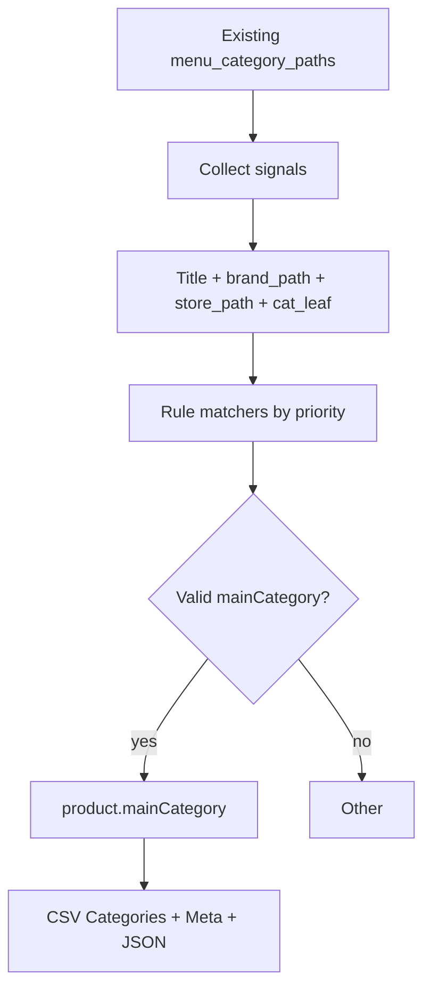

# Add Main Category Classification Layer

## Context

[`converter.py`](D:\Converter\converter.py) already resolves detailed WooCommerce paths via `MenuTaxonomy` + `resolve_menu_category_paths`, then writes them to CSV `Categories` and JSON `category`/`categories`. There is **no** `mainCategory` today. Existing store roots in [`Menu/Categories/All Categories.md`](D:\Converter\Menu\Categories\All Categories.md) (e.g. Fiber Networks, Outdoor Wireless, LTE Products) are related but **not** the same as the new 13-value Main Category list.

**Core rule:** keep all existing `menu_category_paths` unchanged; assign exactly one additional `mainCategory`.

## Output (default)

| Output | Change |
|--------|--------|
| JSON | Add `"mainCategory": "Outdoor"` (etc.) next to `brand` / `category` |
| CSV `Categories` | Prepend main category as a **flat extra** assignment, e.g. `Outdoor, Ubiquiti > UniFi Access Points > Flexible & Outdoor, Outdoor Wireless > ...` — does **not** nest into existing paths |
| CSV meta | Add `Meta: _main_category` (column already exists in template pattern via dynamic headers; add to [`template.csv`](D:\Converter\template.csv) if missing) |
| Tags | Do **not** auto-add main category as a tag (avoids tag clutter) |

Existing detailed paths and brand trees stay exactly as they are.

## Classification pipeline



Hook in [`process_single`](D:\Converter\converter.py) **after** `menu_category_paths` is set (~line 2966):

```python
product["mainCategory"] = assign_main_category(product)
```

## New helpers in `converter.py`

Add near the category builders (~line 2198):

1. **`MAIN_CATEGORIES`** — frozenset of the 13 allowed values  
2. **`assign_main_category(product) -> str`** — orchestration + validation fallback to `"Other"`  
3. **Rule matchers** (first match wins using the priority list below) that score against:
   - joined `menu_category_paths`
   - `cat_path_titles` / `cat_leaf`
   - `brand_path_titles` / `category_root`
   - product `title` / `title_extended` (for Indoor vs Outdoor antennas, etc.)

### Priority order (as specified)

1. Security Systems  
2. Fleet Management  
3. LTE / 5G  
4. Fiber Networks  
5. IoT  
6. Mounts & Brackets  
7. Electrical & Power  
8. Accessories  
9. Outdoor  
10. Indoor  
11. Networking  
12. Licenses  
13. Other  

### Mapping strategy (concrete)

**Store-root shortcuts** (when a resolved store path starts with these):

| Store root / strong path signal | Main Category |
|---------------------------------|---------------|
| Security Systems, Camera Security, Door Access, NVR, Cameras | Security Systems |
| Fleet Management, GPS Trackers | Fleet Management |
| LTE Products, Mobile Network, 4G/5G routers/antennas/modems | LTE / 5G |
| Fiber Networks, SFP, GPON, DAC, XGS-PON | Fiber Networks |
| IoT Solutions, LoRa | IoT |
| Mounts and Brackets, Outdoor/Indoor Mounts, *Mount*, *Bracket* (as primary) | Mounts & Brackets |
| Electrical Equipment, Power Adapters, Solar, Power Cords (not PoE accessories) | Electrical & Power |
| Cables and Cabinets, PoE Adapters/Injectors/Splitters/Converters, Pigtails, Connectors, Surge Protectors, Accessory Tech | Accessories |
| Outdoor Wireless, Outdoor Access Points, Integrated/Sector/Parabolic/Horn antennas, Carrier Backhaul, PtP | Outdoor |
| Home and Office Networks + indoor WiFi AP/router/antenna signals | Indoor |
| Ethernet Devices, Switches, Wired Routers, UniFi Switching/Cloud Gateways, Network Cards | Networking |
| Licenses, UI Care | Licenses |
| Everything Else / unmatched | Other |

**Special rules** (keyword + path, brand ignored as main category):

- **LTE/5G antennas** → `LTE / 5G` (not Indoor/Outdoor)  
- **LoRa antennas** → `IoT`  
- **Wi-Fi indoor/outdoor antennas** → `Indoor` / `Outdoor` from title/path (`indoor`, `outdoor`, `sector`, `parabolic`, `horn`, `ptp`, etc.)  
- **Fiber / DAC cables** → `Fiber Networks`; other cables → `Accessories`  
- **PoE injectors/splitters/converters/adapters** → `Accessories` (not Electrical & Power)  
- **Mounts** → `Mounts & Brackets` even if path says Outdoor/Indoor Mounts  
- Brand names (MikroTik, Ubiquiti, …) never become Main Category  

Implementation style: ordered list of `(main_category, predicate)` callables / compiled keyword groups — readable, easy to tune — rather than ML or free-form generation.

## Output wiring

- [`build_product_json`](D:\Converter\converter.py) (~2668): add `"mainCategory": product.get("mainCategory") or "Other"`  
- [`build_category_paths`](D:\Converter\converter.py): if `mainCategory` set, prepend it as its own comma-separated entry before existing Menu paths  
- [`build_csv_rows`](D:\Converter\converter.py) `apply_meta`: set `Meta: _main_category`  
- [`template-json.json`](D:\Converter\template-json.json): add sample `"mainCategory"`  
- [`template.csv`](D:\Converter\template.csv): ensure `Meta: _main_category` column exists  

**Do not** change [`Menu/`](D:\Converter\Menu) markdown trees or flatten the 300+ detailed categories.

## Validation

- Reject any value outside `MAIN_CATEGORIES` → force `"Other"`  
- Optional debug print in `process_single`: `Main Category: Outdoor`  

## Out of scope

- Regenerating Menu seeds / collection JSON  
- Changing brand taxonomy files  
- Reducing or deleting existing detailed categories  
