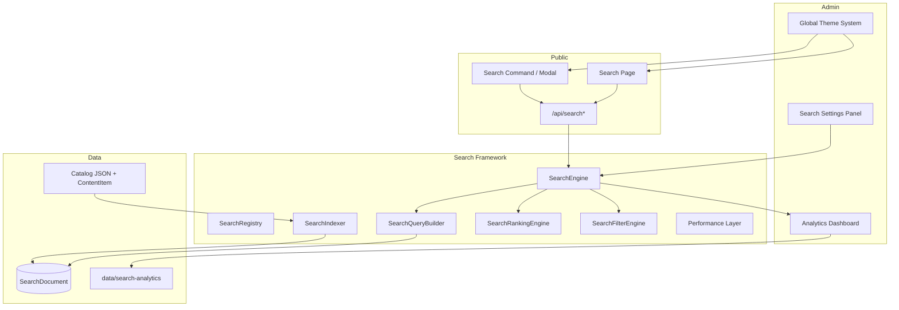

# Search Architecture Audit

Enterprise CMS search — content-type agnostic, schema-driven, theme-integrated.

**Last reviewed:** 2026-06-03

## Deliverables checklist

| Deliverable | Status | Location |
|-------------|--------|----------|
| Search Framework | ✅ | `src/features/search-framework/` |
| Dynamic schema-driven search | ✅ | Content type `adminConfig.search`, field `search: true` |
| Search Settings Admin Panel | ✅ | `/admin/settings/search` |
| Search Analytics Dashboard | ✅ | Settings tab **Analytics** |
| Search Indexing System | ✅ | `SearchIndexer`, `catalog-index-sync`, APIs |
| Improved Search UI/UX | ✅ | `src/features/search/components/search-ui/` |
| Autocomplete System | ✅ | `/api/search/autocomplete`, history, grouping |
| Dynamic Filters | ✅ | `SearchFilterEngine`, discovery, facet chips |
| Theme integration | ✅ | `search-theme.css`, `SearchThemeRoot` |
| Catalog content types (future-proof) | ✅ | Provider registry + DB discovery |
| No hardcoded product-only logic | ✅ | Products via `catalog-providers` plugin |
| Scalability & performance | ✅ | Caching, pagination, capped retrieval, parallel index |

---

## Architecture overview

---

## 1. Search Framework (`search-framework`)

| Module | Responsibility |
|--------|----------------|
| `SearchRegistry` | Register providers by `kind` / `SearchEntityType` |
| `SearchProvider` | `shouldIndex`, `buildRecords` per content kind |
| `SearchIndexer` | Upsert `SearchIndexRecord` → Prisma `SearchDocument` |
| `SearchQueryBuilder` | Sanitize query, entity types, facets, smart tokens |
| `SearchFilterEngine` | Public/admin visibility, `contentTypeSlug`, builtins |
| `SearchRankingEngine` | FULLTEXT + LIKE, boosts, typo / fuzzy scoring |
| `SearchResultMapper` | DB rows → API `SearchResult` |
| `SearchEngine` | Orchestration + `searchPage()` pagination + query cache |
| `SearchAnalytics` | Non-blocking events |
| `performance/` | Cache, body truncation, concurrency limits |

**Entry:** `searchEngine` singleton, exported from `search-framework/index.ts`.

---

## 2. Dynamic schema-driven search

- **Content types:** `discoverCatalogSearchSources()` reads enabled `ContentType` with `adminConfig.search.enabled !== false`.
- **Per-type index map:** `adminConfig.search.index` keys (`title`, `name`, `content`, `custom_fields`, `seo_fields`, …).
- **Field schema:** `ContentFieldDefinition.search` marks builder fields for indexing.
- **New types:** No code change — enable type + configure index map in admin.

Product catalog (`CATALOG_PRODUCT`, etc.) is one provider family in `catalog-providers.ts`, toggled via `search.catalog` / `search.sources`, not baked into the engine.

---

## 3. Admin: Search Settings

**URL:** `/admin/settings/search?tab=<tab>`

| Tab | Purpose |
|-----|---------|
| general | Enable, modes, debounce, limits |
| sources | CMS + catalog source toggles |
| ranking | Weights, fuzziness, exact boost |
| filters | Dynamic filter definitions |
| autocomplete | Suggestions, history, trending |
| smart | Fuzzy, synonyms, semantic hooks |
| appearance | **Theme inherit**, input style, panel width, header |
| analytics | Recording + reports dashboard |
| performance | Cache, retrieval cap, index tuning |

Persistence: `site.json` → `search` via `resolveAdminSearchSettings` / `adminSearchSettingsToSiteJson`.

Runtime: `ensureSearchRuntimeConfig()` → `setSearchPerformanceConfig`, smart/autocomplete resolvers.

---

## 4. Search Analytics Dashboard

- Store: `data/search-analytics/{locale}.json`
- APIs: `POST /api/search/analytics`, `GET /api/admin/search/analytics`
- UI: `search-analytics-panel.tsx`, charts, top terms, zero-results, CTR, filters
- Client: `search-analytics.client.ts` in command + search page

---

## 5. Indexing system

| Trigger | Path |
|---------|------|
| Full rebuild | Admin action / `SearchIndexer.rebuildAll()` |
| Content item | `indexContentItem` on publish |
| Catalog sync | `syncCatalogSearchIndexes` (bulk, deferred revalidate) |
| Product index CLI | Optional `syncCatalogOnProductIndex` |

Indexed fields truncated (`indexBodyMaxChars`), metadata `indexExcerpt` for lean reads.

---

## 6. Public UI / UX

| Surface | Component |
|---------|-----------|
| Header modal | `SearchCommand` → `SearchChrome` + `GlobalSearchPanel` |
| Search page | `SearchPageView` (load-more pagination) |
| Shared UI | `search-ui/*` (chrome, hits, skeletons, filters) |

Discovery: `GET /api/search/discovery` supplies filters + `PublicSearchConfig`.

---

## 7. Autocomplete

- Config: `search-autocomplete-config.ts`
- API: `/api/search/autocomplete` (+ admin variant)
- Features: recent/popular/trending, grouped results, keyboard nav, previews
- History: `search-history.storage.ts` (local)

---

## 8. Dynamic filters

- Admin-defined filters in settings (`resolve-search-filters.ts`)
- Builtin entity type + facet filters
- Discovery merges content-type chips
- `SearchFilterEngine` applies at query and post-rank stages

---

## 9. Theme integration

Search UI **inherits** the global Theme System when `appearance.inheritGlobalTheme` is true (default).

| Theme capability | Search consumption |
|------------------|-------------------|
| Colors / presets | `--color-primary`, `--az-preset-*`, surfaces |
| Typography | `--font-body`, `--font-heading`, `--az-font-*` |
| Border radius | `--az-preset-radius-*`, `--radius` |
| Glass effects | `.az-glass-panel`, `--az-preset-glass-opacity` |
| Blur | `--az-preset-blur-glass`, `blur-panel`, `blur-overlay` |
| Backgrounds | `--az-preset-gradient-hero` (search page hero) |
| Animations | `--motion-scale`, global `animationsEnabled` block |

**Files:**

- `search-theme.css` — maps global tokens → `--sm-search-*`
- `SearchThemeRoot` — wrapper with `sm-search-root--theme`
- `SearchChrome` / `SearchPageView` — wrapped roots
- Admin toggle: **Appearance → Inherit global theme**

Site theme SSR: `ThemeProvider` → `ThemeStyles` + `presetVisualToCssBlock` (same variables search reads).

---

## 10. Performance (large catalogs)

- Lean SQL selects, capped FULLTEXT/LIKE candidates
- In-memory query cache (TTL configurable)
- Offset pagination + `hasMore`
- Parallel index workers, bulk upserts without per-row revalidate
- Composite DB index `(locale, entityType)`

See `docs/SEARCH_FRAMEWORK.md` performance section.

---

## 11. APIs

| Route | Method | Role |
|-------|--------|------|
| `/api/search` | GET | Paginated search |
| `/api/search/autocomplete` | GET | Suggestions |
| `/api/search/discovery` | GET | Filters + public config |
| `/api/search/analytics` | POST | Client events |
| `/api/admin/search/*` | * | Admin search + analytics |

---

## 12. Gaps & recommendations

| Area | Note |
|------|------|
| Shared Redis cache | Query cache is per-process only |
| Semantic search | Optional OpenAI rewrite stub; not production-default |
| Incremental index | Full `indexContentItem` per rebuild item is heavy |
| `SearchCommand` default config | Uses fallback until discovery loads; then uses saved appearance |
| Prisma migration | Run after `SearchDocument` index changes |

---

## Related docs

- `docs/SEARCH_FRAMEWORK.md` — module reference and configuration examples
- `AGENTS.md` — Next.js variant notes
