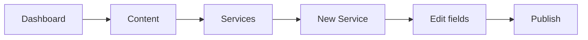

# AZURA Admin Information Architecture

> **Phase 1 deliverable** · Constitution v1.0-draft  
> **Manifest:** [admin-nav-manifest.yaml](./admin-nav-manifest.yaml) · **Profiles:** [profiles/](./profiles/)  
> **Principles:** [architecture-principles.md](./architecture-principles.md#10-user-language-rule) · **Master plan:** [azura-v2.md](./azura-v2.md)

Target admin navigation in **user language** — before code migration (Phase 2+). Implementation of this spec is deferred to Phase 8; routes may remain legacy until then.

---

## Principles

### User Language Rule

| Audience | Sees in admin |
|----------|---------------|
| **Site editor** | Services, Projects, Team, Products, Partners |
| **Developer** | EntityType presets, manifest ids, `href_target` |

Never use **Entities**, **ContentType**, or **Catalog Items** as top-level navigation titles.

### One-question test

> **“Where do I add a Service?”**  
> **Answer:** **Content → Services**

If the answer is unclear, the IA has failed.

### Banned as peer concepts

See [glossary.md § Banned terms](./glossary.md#banned-terms). Summary:

- Product Catalog (group) vs Catalog (group)
- Catalog Items · Listings · Offerings vs Products
- Portal (group) as mini-platforms
- Entities (nav title)

---

## Target navigation wireframe

### Full sidebar (enterprise profile — all features)

```text
┌─────────────────────────────────────┐
│  AZURA Admin                        │
│  [Search nav...]                    │
├─────────────────────────────────────┤
│  ◉ Dashboard                        │
├─────────────────────────────────────┤
│  ▼ Content                          │
│      Pages                          │
│      Blog                           │
│      Products                       │
│      Services                       │
│      Projects                       │
│      Case Studies                   │
│      Team                           │
│      Partners                       │
│      Knowledge Base                 │
│      Pricing Plans                  │
│      Packages                       │  ← tourism profile label
│      Properties                     │  ← tourism profile label
│      Releases                       │
│      Collections                    │  ← product collections
│      Brands & Tags                  │
│      FAQs                           │
│      Testimonials                   │
│      Gallery                        │
├─────────────────────────────────────┤
│  ▼ Media                            │
│      Library                        │
├─────────────────────────────────────┤
│  ▼ Marketing                        │
│      Form Templates                 │
│      Form Submissions               │
│      Inquiries                      │
│      Newsletter                     │
├─────────────────────────────────────┤
│  ▼ Design                           │
│      Studio                         │
│      Header                         │
│      Footer                         │
│      Theme                          │
│      Personalization                │
│      Preloader                      │
│      Announcement Bar               │
│      Popups                         │
│      WhatsApp                       │
├─────────────────────────────────────┤
│  ▼ SEO                              │
│      Overview                       │
│      Redirects                      │
│      Robots.txt                     │
│      Structured Data                │
│      SEO Audit                      │  ← enterprise
│      Integrations                   │  ← enterprise
│      404 Pages                      │  ← enterprise
├─────────────────────────────────────┤
│  ▼ Modules                          │
│      Documentation                  │
│      Status Page                    │
├─────────────────────────────────────┤
│  ▼ Settings                         │
│      Languages                      │
│      Translations                   │
│      Site Access                    │
│      Search                         │
│      Admin Account                  │
│      Customer Accounts              │
│      Visitor Portal                 │
│      Company Info                   │
├─────────────────────────────────────┤
│  ▼ System                           │
│      Content Types                  │  ← developer / Phase 9
│      Database                       │
│      Performance                    │
│      Demo Profiles                  │
│      Theme Presets                  │  ← /admin/presets
└─────────────────────────────────────┘
```

### Collapsed sidebar

Icons only; tooltips show user labels from manifest. Group order unchanged.

### Marketing profile (minimal)

```text
Dashboard
Content      → Pages, Blog, FAQs, Testimonials, Gallery
Media        → Library
Marketing    → Forms, Form Submissions, Inquiries, Newsletter
Design       → Studio, Header, Footer, Theme, WhatsApp
SEO          → Overview, Redirects, Robots, Structured Data
Settings     → Languages, Translations, Site Access, Search, …
```

No preset entity items, Modules, or System (except optional Demo Profiles).

---

## Navigation groups

| Group id | User label | Purpose | Constitution owner |
|----------|------------|---------|-------------------|
| `dashboard` | Dashboard | Overview, quick stats | `cms/` |
| `content` | Content | Pages, blog, preset entities, editorial extras | `cms/` + presets |
| `media` | Media | Asset library | `media/` |
| `marketing` | Marketing | Leads and conversion | `leads/` |
| `design` | Design | Builder chrome, theme, promos | `builder/` + `theme/` |
| `seo` | SEO | Discoverability | `seo/` |
| `modules` | Modules | Optional vertical products | modules |
| `settings` | Settings | Site configuration | `platform/` |
| `system` | System | Operator / developer tools | `platform/` |

**Removed groups:** `product-catalog`, `catalog`, `portal`.

---

## Editorial vs preset content

| Type | Examples | Nav location | Concept |
|------|----------|--------------|---------|
| **Editorial** | Pages, Blog posts | Content → Pages, Blog | Page, Post |
| **Structured preset** | Products, Services, Team | Content → [user label] | Entity + preset |
| **Editorial extras** | FAQs, Testimonials, Gallery | Content | CMS features (may become presets later) |

Preset items appear **only** when enabled by [deployment profile](./profiles/).

---

## Preset registry (admin)

| presetId | Default user label | Icon | href_current | href_target | Notes |
|----------|-------------------|------|--------------|-------------|-------|
| `product` | Products | Package | `/admin/products` | `/admin/products` | Stable |
| `service` | Services | Briefcase | `/admin/content/offerings` | `/admin/services` | `/admin/services` redirects today |
| `project` | Projects | FolderKanban | — | `/admin/projects` | New route Phase 2+ |
| `case-study` | Case Studies | FileText | — | `/admin/case-studies` | New route Phase 2+ |
| `team-member` | Team | Users | `/admin/team` | `/admin/team` | From Portal |
| `partner` | Partners | Handshake | `/admin/partners` | `/admin/partners` | From Portal |
| `knowledge` | Knowledge Base | BookOpen | `/admin/knowledge-base` | `/admin/knowledge-base` | [RFC-001](./rfc-001-knowledge-base-reclassification.md) |
| `pricing` | Pricing Plans | DollarSign | `/admin/pricing-plans` | `/admin/pricing-plans` | From Portal |
| `destination` | Destinations | MapPin | `/admin/content/catalog-items` | `/admin/packages` | Tourism label: **Packages** |
| `property` | Properties | Building | `/admin/content/listings` | `/admin/hotels` | Tourism may use **Listings** alias |
| `release` | Releases | Rocket | `/admin/releases` | `/admin/releases` | Changelog preset |
| `event` | Events | Calendar | — | `/admin/events` | Future preset |

### Profile-specific labels

| presetId | Profile | User label override |
|----------|---------|---------------------|
| `destination` | tourism | Packages |
| `destination` | agency, showroom | Destinations (if enabled) |
| `property` | tourism | Properties (or Listings in legacy docs) |

---

## Module registry (admin)

| moduleId | User label | href | Profiles |
|----------|------------|------|----------|
| `documentation` | Documentation | `/admin/documentation` | documentation, enterprise |
| `status-page` | Status Page | `/admin/status` | enterprise |
| `enterprise-translation` | *(no top-level nav)* | — | enterprise — under Settings |
| `advanced-seo` | *(items under SEO)* | audit, integrations, 404 | enterprise |

---

## IA decisions (frozen for Phase 2+)

| Question | Decision | Rationale |
|----------|----------|-----------|
| **Collections** | Content → **Collections** (`/admin/collections`) for product collections; shared label, product-preset context in showroom | One entry; showroom profile enables |
| **Brands & Tags** | Content → **Brands & Tags** (`/admin/catalog-taxonomy`) | User language; ties to product preset |
| **Entity Type schema admin** | System → **Content Types** (`/admin/content/types`) | Developer tool; hidden on marketing profile |
| **Content hub** (`/admin/content`) | Remove from user nav; redirect to Content Types in System | Was duplicate “Content” label |
| **SEO Audit / Integrations / 404** | SEO group; **enterprise profile only** | advanced-seo Module |
| **Pricing Calculators** | Content → **Pricing Plans** sub-area or sibling **Calculators** under same preset | Preset extension, not Module |
| **Releases** | Content → **Releases** | Preset `release`, not Blog |
| **WhatsApp** | **Design** group | FAB/chrome configuration with theme |
| **Inquiries / Forms** | **Marketing** group | Lead capture |
| **Media vs Gallery** | Media group = **Library**; Gallery stays under Content | Gallery is curated albums |
| **Modules section** | Own group **Modules** for documentation + status | Clear Module boundary |
| **Theme Presets** | System → **Theme Presets** (`/admin/presets`) | Operator tool |

---

## User task flows

### 1. Add a Service



1. Sidebar → **Content** → **Services**
2. Click **New** (or equivalent CTA)
3. Fill title, description, CTA fields
4. Publish

*Today:* nav says “Offerings” → `/admin/content/offerings`; `/admin/services` redirects there.

### 2. Add a Product

1. **Content** → **Products**
2. Open product manager / import as today
3. Configure PDP-related fields

*Today:* under **Product Catalog** group — target moves under **Content**.

### 3. Manage Team

1. **Content** → **Team**
2. Add departments / members per existing team admin

*Today:* under **Portal** → Team.

### 4. Add Knowledge Base article

1. **Content** → **Knowledge Base**
2. Select or create KB → **New article**

*Today:* Portal → Knowledge Base. See RFC-001.

### 5. Review form submission

1. **Marketing** → **Form Submissions**
2. Open submission → follow up

*Today:* under **Catalog** group.

### 6. Add SEO redirect

1. **SEO** → **Redirects**
2. Add source → destination

### 7. Change site coming-soon mode

1. **Settings** → **Site Access**
2. Toggle coming soon / maintenance

### 8. Upload media for a page

1. **Media** → **Library** (upload)
2. **Content** → **Pages** → open page → insert in builder

---

## Breadcrumb rules

During transition (Phase 1–5):

| Path visited | Breadcrumb label (target) | Notes |
|--------------|---------------------------|-------|
| `/admin/content/offerings` | Content → Services | Map legacy URL to target label |
| `/admin/content/catalog-items` | Content → Packages *or* Destinations | Profile-dependent |
| `/admin/content/listings` | Content → Properties | |
| `/admin/products` | Content → Products | |
| `/admin/content/types` | System → Content Types | Developer |

Breadcrumb resolver should use **manifest `label`**, not URL segment (`offerings`).

Implementation: Phase 8 with [`getBreadcrumbs`](src/config/admin-nav.ts) refactor.

---

## Legacy → target mapping (full)

| Current group | Current label | Current href | Target group | Target label | preset / module |
|---------------|---------------|--------------|--------------|--------------|-----------------|
| — | Dashboard | `/admin` | dashboard | Dashboard | — |
| content | Pages | `/admin/pages` | content | Pages | — |
| content | Blog | `/admin/posts` | content | Blog | — |
| content | Media | `/admin/media` | media | Library | — |
| content | Gallery | `/admin/gallery` | content | Gallery | — |
| content | FAQs | `/admin/faqs` | content | FAQs | — |
| content | Testimonials | `/admin/testimonials` | content | Testimonials | — |
| product-catalog | Products | `/admin/products` | content | Products | product |
| product-catalog | Collections | `/admin/collections` | content | Collections | product |
| product-catalog | Brands & Tags | `/admin/catalog-taxonomy` | content | Brands & Tags | product |
| catalog | Content | `/admin/content` | system | Content Types | — |
| catalog | Catalog Items | `/admin/content/catalog-items` | content | Packages / Destinations | destination |
| catalog | Listings | `/admin/content/listings` | content | Properties | property |
| catalog | Offerings | `/admin/content/offerings` | content | Services | service |
| catalog | Inquiries | `/admin/inquiries` | marketing | Inquiries | — |
| catalog | Form Templates | `/admin/forms` | marketing | Form Templates | — |
| catalog | Form Submissions | `/admin/form-submissions` | marketing | Form Submissions | — |
| catalog | Newsletter | `/admin/newsletter` | marketing | Newsletter | — |
| portal | Pricing Plans | `/admin/pricing-plans` | content | Pricing Plans | pricing |
| portal | Releases | `/admin/releases` | content | Releases | release |
| portal | Calculators | `/admin/pricing-calculators` | content | Calculators | pricing |
| portal | Knowledge Base | `/admin/knowledge-base` | content | Knowledge Base | knowledge |
| portal | Documentation | `/admin/documentation` | modules | Documentation | documentation |
| portal | Status | `/admin/status` | modules | Status Page | status-page |
| portal | Team | `/admin/team` | content | Team | team-member |
| portal | Partners | `/admin/partners` | content | Partners | partner |
| design | Studio | `/admin/studio` | design | Studio | — |
| design | Header Builder | `/admin/header` | design | Header | — |
| design | Footer Builder | `/admin/footer` | design | Footer | — |
| design | Theme Studio | `/admin/theme` | design | Theme | — |
| design | Personalization | `/admin/personalization` | design | Personalization | — |
| design | Preloader | `/admin/preloader` | design | Preloader | — |
| design | Announcement Bar | `/admin/announcement-bar` | design | Announcement Bar | — |
| design | Popup Management | `/admin/popups` | design | Popups | — |
| design | WhatsApp | `/admin/settings/whatsapp` | design | WhatsApp | — |
| seo | SEO | `/admin/seo` | seo | Overview | — |
| seo | SEO Audit | `/admin/seo/audit` | seo | SEO Audit | advanced-seo |
| seo | Redirects | `/admin/seo/redirects` | seo | Redirects | — |
| seo | Robots.txt | `/admin/seo/robots` | seo | Robots.txt | — |
| seo | Structured Data | `/admin/seo/structured-data` | seo | Structured Data | — |
| seo | SEO Integrations | `/admin/seo/integrations` | seo | Integrations | advanced-seo |
| seo | 404 Pages | `/admin/seo/404` | seo | 404 Pages | advanced-seo |
| settings | Site access | `/admin/settings/site` | settings | Site Access | — |
| settings | Search | `/admin/settings/search` | settings | Search | — |
| settings | Admin account | `/admin/settings/account` | settings | Admin Account | — |
| settings | Customer accounts | `/admin/users` | settings | Customer Accounts | — |
| settings | Visitor portal | `/admin/settings/portal` | settings | Visitor Portal | — |
| system | Languages | `/admin/languages` | settings | Languages | — |
| system | Translations | `/admin/translations` | settings | Translations | — |
| system | Company Info | `/admin/company` | settings | Company Info | — |
| system | Database | `/admin/database` | system | Database | — |
| system | Performance | `/admin/performance` | system | Performance | — |
| system | Demo Profiles | `/admin/demo-profiles` | system | Demo Profiles | — |

### Orphan routes (not in current nav)

| href | Target label | Target group | Notes |
|------|--------------|--------------|-------|
| `/admin/packages` | Packages | content | Redirects to catalog-items; tourism |
| `/admin/hotels` | Properties | content | Redirects to listings |
| `/admin/services` | Services | content | Redirects to offerings |
| `/admin/presets` | Theme Presets | system | Theme preset manager |
| `/admin/catalog-products` | *(redirect)* | — | Redirects to `/admin/products` |
| `/admin/catalog-collections` | *(redirect)* | — | Redirects to `/admin/collections` |
| `/admin/settings` | Settings hub | settings | Optional landing; children in nav |

---

## Transition period

| Phase | Admin behavior |
|-------|----------------|
| **1 (now)** | Spec + manifest only; current nav unchanged |
| **2** | Optional `AZURA_ADMIN_IA_V2=1` flag using manifest |
| **5** | Preset reclassification; route aliases |
| **7** | Profile-driven nav from `docs/profiles/*.yaml` |
| **8** | Replace `ADMIN_NAV_GROUPS` with manifest loader |

Redirects to document for Phase 2+:

- `/admin/content/offerings` → `/admin/services` (canonical)
- `/admin/content/catalog-items` → `/admin/packages` (tourism) or keep slug route
- `/admin/content/listings` → `/admin/hotels` or `/admin/properties`

---

## Exit criteria (Phase 1)

- [x] “Where do I add a Service?” → **Content → Services**
- [x] Full legacy mapping table (above + manifest)
- [x] Profile visibility YAMLs in [profiles/](./profiles/)
- [x] IA decisions documented
- [x] No changes to `src/config/admin-nav.ts`

---

## Related documents

- [admin-nav-manifest.yaml](./admin-nav-manifest.yaml)
- [glossary.md](./glossary.md)
- [deployment-profiles.md](./deployment-profiles.md)
- [constitution.md](./constitution.md)
