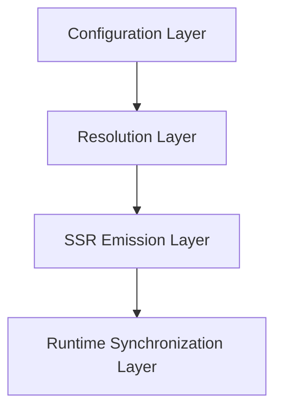
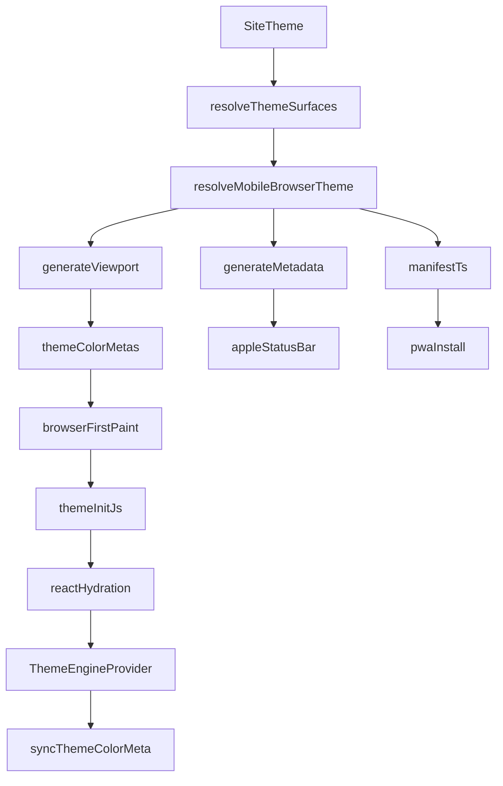
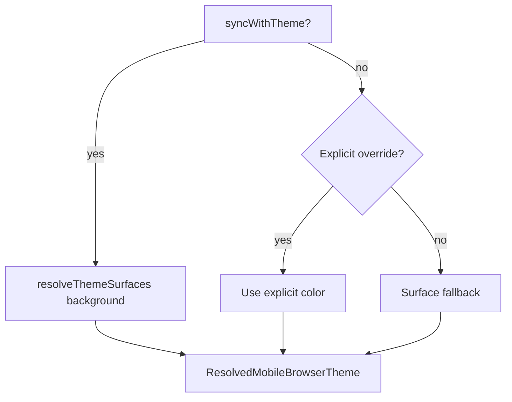
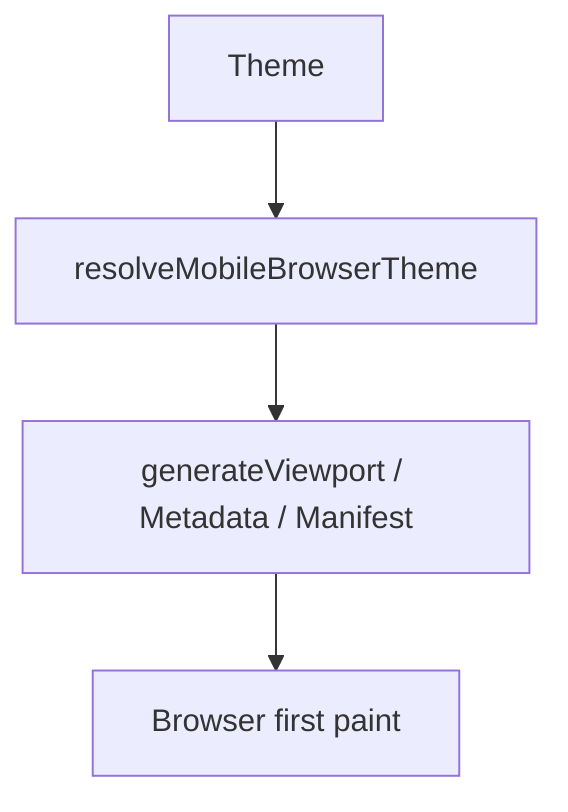
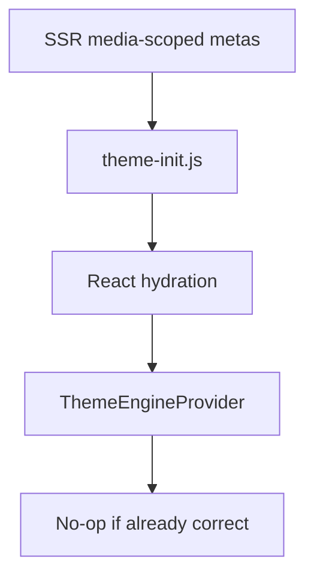
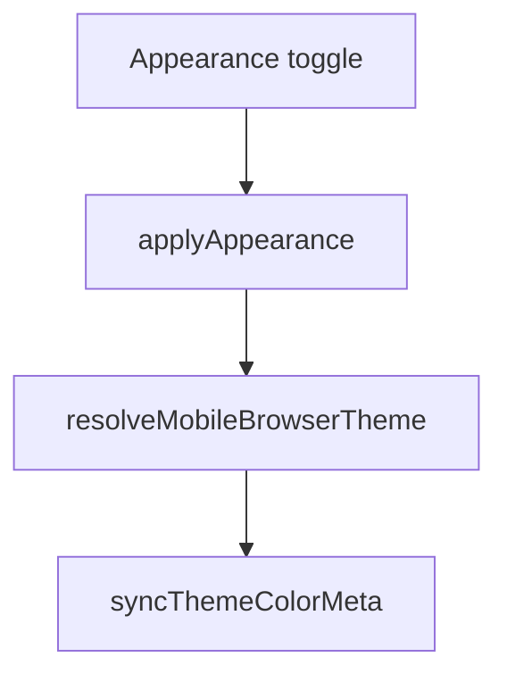
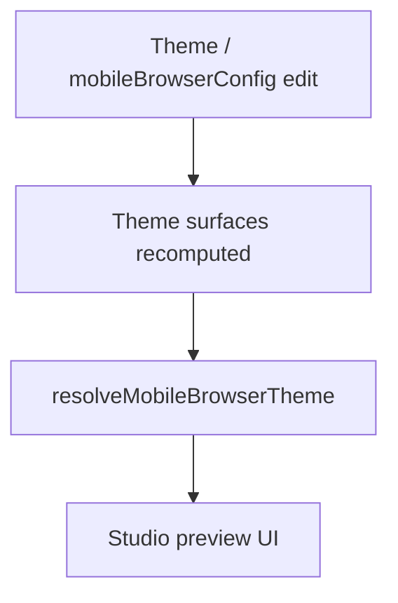

# Browser Chrome Theme Synchronization

## Architectural Decision

Browser Chrome Theme Synchronization is implemented exclusively through standards-supported Theme Color, manifest, and Apple web app metadata.

Browser-controlled immersive behaviors (dynamic toolbar tinting, hero sampling, translucent omnibox rendering) are intentionally excluded because they are not reliably controllable through public web APIs.

For investigation of unsupported immersive chrome, see [immersive-chrome-audit.md](./immersive-chrome-audit.md).

For route-dependent browser chrome States A/B/C (including light chrome while the app is dark), see [immersive-rendering-audit.md](./immersive-rendering-audit.md). Phase 0 must verify SSR head identity before treating failures as immersive heuristics alone; State A demonstrates Theme Color *can* work—it does not prove metadata is correct on every route.

## Document Status

**Status:** Canonical architecture specification (aligned with zero-trust audit)

This document defines the architectural contracts for Browser Chrome Theme Synchronization. If implementation details conflict with this specification, either the implementation or this specification MUST be updated so they remain consistent.

**Architectural authority for synchronization correctness:** [browser-chrome-zero-trust-audit.md](./browser-chrome-zero-trust-audit.md) (Sync Contract, Theme State Contract, Projection Architecture, Phase 16 validation). Claims that Theme Color is “correct” on a route without Phase 16 / audit evidence are **superseded**.

Normative keywords **MUST**, **MUST NOT**, **SHOULD**, and **MAY** are used as in RFC 2119.

Where sections distinguish **Contract** from **Current implementation**, the Contract is normative. Current implementation describes one way the Contract is satisfied today and MAY change without rewriting this specification, provided the Contract remains true.

### Synchronization Contract (normative)

Synchronization means Application State → Resolved Theme → Projection → Browser, without stale reads, stale caches, duplicate ownership, duplicate resolution, or race-induced divergence.

### Theme State and projections (normative)

Canonical theme state and projection layers are defined in the [zero-trust audit Premises](./browser-chrome-zero-trust-audit.md#premises--architectural-contracts-before-phase-0). Writers MUST be **projection consumers** of resolved theme / `resolveMobileBrowserTheme()` output.

**Computed CSS (`getComputedStyle` / `--az-bg-primary`) MUST NOT be the primary source of truth for browser chrome colors** when the Theme Engine or SSR resolver already holds the semantic value. Computed style MAY be a last-resort fallback only.

## Purpose

Tint mobile browser chrome and PWA splash colors to match the site theme, and keep that tint synchronized when Appearance changes—using only public web platform metadata.

## Terminology

| Term | Definition |
|------|------------|
| **Appearance** | The active light / dark selection after resolving system vs forced preference. |
| **Theme** | The configured design tokens and palette for the site. |
| **Theme surface** | The resolved background (and related) colors used for application surfaces. |
| **Browser chrome** | Browser-owned UI such as the address bar or status bar. |
| **Theme Color** | The standards-supported mechanism (`<meta name="theme-color">` / manifest `theme_color`) that tints browser chrome with a solid color. |
| **Background** | The resolved splash / loading / PWA `background_color` value (not necessarily the same as live page paint). |
| **Forced appearance** | Explicit `light` or `dark` Appearance mode that overrides OS preference. |
| **System appearance** | Appearance mode `system`, where OS `prefers-color-scheme` drives the resolved light/dark value. |
| **PWA splash** | The install-time / launch splash experience driven by web app manifest colors. |

## Scope and Non-goals

### In scope

- Resolving light/dark Theme Color and Background from Theme configuration
- SSR emission of `theme-color`, viewport-fit, Apple status bar style, and manifest colors
- Runtime synchronization of `theme-color` metas when Forced appearance or Appearance toggles require it
- Theme Studio configuration of `mobileBrowserConfig`

### Non-goals

- Hero color extraction into the address bar
- Scroll-based address bar tinting
- Per-component or per-route chrome colors (unless added later via the Resolution Layer)
- Browser-specific CSS hacks for translucent omnibox blending
- Unsupported Dynamic Browser Chrome / content-sampled immersive address bar
- Platform-specific visual workarounds that are not documented with Spec Support and Verified status
- Explaining or fixing Chrome edge-to-edge / Dynamic Toolbar heuristics across routes (see [immersive-rendering-audit.md](./immersive-rendering-audit.md)); that audit also owns Phase 0 verification when browser appearance mismatches the app theme
- Claiming Theme Color is correct on every route without Phase 0 evidence (State A alone is insufficient)

## Architecture Overview (Layers)

| Layer | Responsibility |
|-------|----------------|
| **Configuration** | Persist `SiteTheme.mobileBrowserConfig` |
| **Resolution** | Pure mapping from Theme + config → `ResolvedMobileBrowserTheme` |
| **SSR Emission** | Emit first-paint metadata (viewport, Apple meta, manifest, related fallbacks) |
| **Runtime Synchronization** | Correct or update `theme-color` after boot / Appearance changes without orphaning SSR-owned nodes |

End-to-end data flow:

## Ownership

| Component | Responsibility |
|-----------|----------------|
| `SiteTheme.mobileBrowserConfig` | Persistent configuration |
| `resolveMobileBrowserTheme()` | Pure resolution |
| `generateViewport()` | Initial SSR `theme-color` + `viewport-fit` |
| `generateMetadata()` | Apple web app status bar |
| `manifest.ts` | PWA install `theme_color` / `background_color` |
| `theme-init.js` | Pre-React correction for Forced appearance only |
| `ThemeEngineProvider` | Runtime sync orchestration only |
| `syncThemeColorMeta()` | Exclusive DOM mutator for `theme-color` (post-boot path) |

### Exclusive writer set

**Contract:** Only members of the exclusive writer set MAY mutate `<meta name="theme-color">` elements:

1. `public/theme-init.js` (pre-React path)
2. `syncThemeColorMeta()` (called from `ThemeEngineProvider`)

No other component MAY create, remove, or rewrite `theme-color` metas.

## Invariants

### Resolver

**Contract:**

- Given identical Theme tokens (including `mobileBrowserConfig`) and identical surface inputs, `resolveMobileBrowserTheme()` MUST return identical output.
- The resolver MUST be a pure function: no DOM, no browser APIs, no side effects.

**Current implementation:** [`src/lib/theme/resolve-mobile-browser-theme.ts`](../src/lib/theme/resolve-mobile-browser-theme.ts)

### SSR

**Contract:**

- SSR output MUST already be correct for light and dark media-qualified Theme Color pairs before JavaScript executes (when System appearance is in effect or no Forced appearance override exists).
- SSR emitters MUST remain the source of first-paint metadata.

**Current implementation:** `generateViewport` / `generateMetadata` in [`src/app/[locale]/layout.tsx`](../src/app/[locale]/layout.tsx), [`src/app/manifest.ts`](../src/app/manifest.ts)

### Runtime

**Contract:**

- `ThemeEngineProvider` MUST NOT derive browser chrome colors independently. It MUST consume resolver output (`resolveMobileBrowserTheme` / Theme State `browserProjection`).
- **Computed document background MUST NOT be the primary chrome color input.**
- Runtime synchronization MUST preserve SSR ownership of meta nodes (in-place content updates only when metas already exist).
- `syncThemeColorMeta` MUST update existing `theme-color` meta elements in place and MUST NOT remove or recreate them when they already exist.
- Preset changes MUST re-project browser chrome (same as Appearance changes).

**Current implementation:** [`src/components/theme/theme-engine-provider.tsx`](../src/components/theme/theme-engine-provider.tsx), [`src/features/theme/engine/appearance.ts`](../src/features/theme/engine/appearance.ts)

## Configuration Model

Configuration lives on `SiteTheme.mobileBrowserConfig` (JSON column), validated by `mobileBrowserConfigSchema` in [`src/schemas/theme.ts`](../src/schemas/theme.ts).

| Field | Role |
|-------|------|
| `syncWithTheme` | When `true` (default), derive chrome colors from Theme surfaces |
| `browserThemeColorLight` | Manual light Theme Color override when sync is off |
| `browserThemeColorDark` | Manual dark Theme Color override when sync is off |
| `browserBackgroundColor` | Manual Background / splash override when sync is off |
| `iosStatusBarStyle` | `default` \| `black` \| `black-translucent` |

**Note:** The schema does not yet include a `version` field. Adding `version: 1` (and migration rules) is a future extension; see [Future Extension Points](#future-extension-points).

Admin UI: Theme Studio → Mobile Browser section.

## Color Source Hierarchy

**Contract:**

- When `syncWithTheme` is `true`, Theme Color and Background MUST come from resolved Theme surface backgrounds (manual color fields MUST be ignored for those values).
- When `syncWithTheme` is `false`, explicit overrides MUST be preferred; absent overrides MUST fall back to Theme surface backgrounds; implementations SHOULD still provide a safe default if surfaces are unavailable.
- `iosStatusBarStyle` MUST be taken from configuration (defaulting to `default`) regardless of `syncWithTheme`.

## Resolution Algorithm

**Contract:** All browser chrome color resolution MUST enter through `resolveMobileBrowserTheme()`.

**Current implementation:** [`resolveMobileBrowserTheme`](../src/lib/theme/resolve-mobile-browser-theme.ts) calls `resolveThemeSurfaces` for light and dark, then applies the hierarchy above. Call sites include SSR layout metadata, manifest generation, locale layout preloader fallback, Theme Studio preview, and `ThemeEngineProvider` sync.

## Two Metadata Sources

| Mechanism | Purpose |
|-----------|---------|
| `<meta name="theme-color">` | Current **page** browser chrome tint |
| Manifest `theme_color` | Installed **PWA** chrome / install experience |
| Manifest `background_color` | **PWA splash** / loading background before first paint |

**Contract:** Page Theme Color and manifest colors MAY differ in responsibility even when they share the same resolved values. Implementations MUST NOT treat them as interchangeable APIs.

**Current implementation:** Manifest uses light Theme Color and resolved Background; viewport emits media-scoped light/dark Theme Color pairs.

## Rendering Pipeline (SSR)

**Contract:**

- SSR MUST emit media-qualified light and dark `theme-color` values from the resolver.
- SSR MUST emit `viewport-fit=cover` when edge-to-edge / safe-area support is required by product policy.
- SSR MUST emit Apple web app status bar style from the resolver when Apple metadata is enabled.
- Manifest MUST expose `theme_color` and `background_color` from the resolver for install experiences.

**Current implementation:**

| Emitter | Location | Emits |
|---------|----------|-------|
| `generateViewport` | [`src/app/[locale]/layout.tsx`](../src/app/[locale]/layout.tsx) | `themeColor` light/dark media pairs, `viewportFit: "cover"`, `colorScheme` |
| `generateMetadata` | same | `appleWebApp.statusBarStyle`, manifest link |
| `manifest()` | [`src/app/manifest.ts`](../src/app/manifest.ts) | `theme_color`, `background_color` |
| Locale layout data | [`src/features/i18n/load-locale-layout-data.ts`](../src/features/i18n/load-locale-layout-data.ts) | Preloader `fallbackBackgroundColor` from resolver Background |

## Runtime Synchronization

### Forced appearance first-paint correction

**Contract:** The runtime MUST eliminate Forced appearance first-paint mismatch against SSR media-scoped metas before React hydration, when a Forced appearance is stored client-side.

**Current implementation:** [`public/theme-init.js`](../public/theme-init.js) Forced path uses paint-matching priority (visitor preset → computed CSS → boot/SSR metas), mirrored by [`resolveForcedChromeColor`](../src/lib/theme/resolve-forced-chrome-color.ts). System appearance leaves SSR media-scoped metas intact.

### System appearance

**Contract:** System appearance MUST intentionally delegate Chromium browser chrome selection to the browser by restoring or preserving media-qualified `theme-color` metas. Safari 26+ ignores those metas — Runtime Synchronization MUST still project the resolved active tint via `syncSafariChromeTint` (CSS var + edge anchors).

**Current implementation:** `syncThemeColorMeta(..., { mode: "system", lightColor, darkColor })` writes light/dark colors onto the corresponding media-scoped metas.

### Post-hydration Appearance changes

**Contract:**

- After Appearance apply, Theme Color metas MUST be synchronized via the exclusive writer set.
- Applications MUST NOT assume browser chrome repaints synchronously; Theme Color DOM mutations are synchronous, but browsers MAY delay chrome visual updates until a later frame or navigation.

**Current implementation:** `ThemeEngineProvider.applyAppearance` / hydrate catch-up call `syncThemeColorMeta` (often on `requestAnimationFrame`). Event notification uses `notifyAppearanceChange` / `devi:theme-change` with `appearanceOnly: true`; meta sync is owned by the provider paths, not by arbitrary event listeners.

## Event Model

**Contract:** Meta synchronization MUST remain owned by the SSR emitters and the exclusive writer set. Appearance-change events MAY notify consumers of Appearance updates but MUST NOT become an open invitation for additional `theme-color` mutators.

**Current implementation:**

| Event / API | Role |
|-------------|------|
| `devi:theme-change` (`THEME_CHANGE_EVENT`) | Dispatched via `dispatchThemeChange` |
| `notifyAppearanceChange(mode, resolved, { appearanceOnly: true })` | Appearance-only notification after provider apply |

**Not implemented (future):** dedicated `THEME_SURFACES_CHANGED` or admin `THEME_PREVIEW_CHANGED` events that trigger chrome sync outside the provider.

## Browser Capability Matrix

Every feature × browser cell MUST distinguish **Spec Support** from **Verified**. Unverified cells MUST say Pending (or link to the [immersive chrome audit worksheet](./immersive-chrome-audit.md#fixture-test-worksheet-fill-on-device)), not imply device proof.

| Feature | Chrome Android | Edge Android | Samsung Internet | Firefox Android | Safari (iOS) | iOS PWA |
|---------|----------------|--------------|------------------|-----------------|--------------|---------|
| Theme Color (Spec) | Supported | Supported | Supported | Partial | Limited (ignored Safari 26+) | N/A (uses status bar / install chrome) |
| Theme Color (Verified) | Pending | Pending | Pending | Pending | Pending | Pending |
| Media-qualified Theme Color (Spec) | Supported | Supported | Supported | Partial | Limited / ignored Safari 26+ | N/A |
| Media-qualified Theme Color (Verified) | Pending | Pending | Pending | Pending | Pending | Pending |
| Safari edge paint (`--az-browser-chrome-tint` + anchors) | N/A | N/A | N/A | N/A | Spec: Safari 26+ sampling | Spec: status bar / install |
| Safari edge paint (Verified) | N/A | N/A | N/A | N/A | Pending | Pending |
| `viewport-fit=cover` (Spec) | Supported | Supported | Supported | Supported | Supported | Supported |
| `viewport-fit=cover` (Verified) | Pending | Pending | Pending | Pending | Pending | Pending |
| Apple status bar style (Spec) | — | — | — | — | Home Screen / limited | Supported |
| Apple status bar style (Verified) | N/A | N/A | N/A | N/A | Pending | Pending |
| Manifest `theme_color` (Spec) | Supported | Supported | Supported | Supported | Partial | Install / standalone |
| Manifest `theme_color` (Verified) | Pending | Pending | Pending | Pending | Pending | Pending |

Production HTML already emits media-scoped Theme Color and `viewport-fit=cover` (see audit Phase 1). Device verification remains Pending.

## Lifecycles

### 1. Initial SSR

### 2. Forced appearance hydration

### 3. Theme toggle (Appearance)

### 4. Admin Theme Studio preview

**Contract:** Admin preview MUST NOT mutate production page `theme-color` metas until publish / live site apply paths run. Preview updates the Studio UI only.

## Failure Modes

| Failure | Recovery |
|---------|----------|
| Missing config | Surface fallback |
| Missing override | Surface fallback |
| Invalid config | Validation failure (schema / parse) |
| Missing CSS variables | Resolver hex / safe default fallback |
| DOM mutation exception | Preserve existing metas |
| Manifest unavailable | Page chrome unaffected |

**Contract:** Implementations MUST NOT emit invalid Theme Color values when recovery paths exist. On DOM mutation failure, existing metas MUST be left intact when possible.

## Performance Guarantees

**Contract:**

- Runtime `theme-color` synchronization SHOULD be O(number of `theme-color` metas).
- `syncThemeColorMeta` MUST NOT force layout/reflow as part of its normal path (attribute writes only).
- Meta content MUST be written only when the value would change.
- Meta sync MUST NOT require a React re-render.

**Current implementation:** `syncThemeColorMeta` compares content before writing. `theme-init.js` performs one computed-style read at boot (Forced appearance path)—an accepted tradeoff for first-paint correction, not a license for additional layout reads in the post-boot path.

## Testing Strategy

Tests and evidence MUST map to architecture contracts:

| Contract | Tests / evidence |
|----------|------------------|
| Resolver purity + color hierarchy | [`src/lib/theme/__tests__/resolve-mobile-browser-theme.test.ts`](../src/lib/theme/__tests__/resolve-mobile-browser-theme.test.ts) |
| Meta ownership / in-place updates | [`src/features/theme/engine/__tests__/sync-theme-color-meta.test.ts`](../src/features/theme/engine/__tests__/sync-theme-color-meta.test.ts) |
| SSR correctness | **Gap:** automated `generateViewport` / metadata / manifest assertions (document; not required by this pass) |
| Hydration correction / System appearance | Device QA + Spec/Verified matrix |
| Exclusive writer set | Code review + one-line ownership pointers; no additional meta mutators |

Manual QA targets: Chrome Android, Samsung Internet, Firefox Android, iOS Safari, installed PWA. Use the audit [fixture worksheet](./immersive-chrome-audit.md#fixture-test-worksheet-fill-on-device) when verifying immersive vs Theme Color distinctions.

## Maintenance Rules

1. New browser chrome behavior MUST enter through `resolveMobileBrowserTheme()`.
2. New DOM mutations MUST NOT bypass `syncThemeColorMeta()` (except the documented `theme-init.js` pre-React path).
3. SSR emitters MUST remain the source of first-paint metadata.
4. Runtime synchronization MUST preserve SSR ownership of meta nodes.
5. Browser-specific workarounds MUST be documented with supported platforms and Spec vs Verified status.
6. Unsupported browser behaviors belong in [immersive-chrome-audit.md](./immersive-chrome-audit.md), not this architecture.

## Future Extension Points

May belong here after an architecture update:

- Config `version` (e.g. `{ version: 1, ... }`) and migration
- Android navigation bar color (if a standards path exists)
- Per-page or route-specific browser chrome (via Resolution Layer)
- Installed PWA-only variants of Theme Color / Background
- New events such as surfaces-changed → resolve → sync (still through exclusive writers)
- Dynamic color extraction **only if** browser APIs become public and reliable

MUST NOT be forced into this system without revising Scope and Non-goals:

- Hero sampling / translucent omnibox
- Scroll-aware chrome tinting as a product guarantee
- OEM-only blending hacks
- Unrelated Theme Studio features that do not affect browser chrome metadata

## Design Constraints

- Next.js / React head ownership: existing `theme-color` nodes MUST be updated in place; removing them orphans head fibers and can crash reconciliation.
- Visual “immersive blend with hero” is limited by layout/paint (site header) and by unsupported Dynamic Browser Chrome—not by missing Theme Color wiring. See [immersive-chrome-audit.md](./immersive-chrome-audit.md) STOP decision.
- Route-dependent or menu-triggered immersive bottom chrome belongs to [immersive-rendering-audit.md](./immersive-rendering-audit.md), not this specification.
- Browser appearance mismatch (e.g. light chrome while Forced dark) must be checked via that audit’s Phase 0 before assuming this architecture’s SSR emission is intact on every route.
