# Browser-Theme Synchronization — Zero-Trust Architecture Audit

**Status:** Audit + architectural contracts complete; Waves 0–3 implementation landed. Phase 16 Observed validation Pending.  
**Date:** 2026-07-18  
**Scope:** Application theme state, appearance resolution, CSS variable provenance, ownership transfer, caches, async races, browser chrome projection, and formal synchronization/state contracts.  
**Non-goals:** Immersive Dynamic Toolbar / hero sampling; admin chrome parity.

---

## Architectural principle (burden of proof)

**The burden of proof is on the existing architecture.** Every subsystem, lifecycle, cache, ownership boundary, resolver, and synchronization step must justify its continued existence. **Existing implementation is not evidence of necessity.**

Components are not retained because they already exist. This audit must explicitly justify keeping every surviving subsystem. Prefer removal over preservation whenever unique responsibility cannot be justified.

Prior documents ([browser-chrome-theme-sync.md](./browser-chrome-theme-sync.md), [immersive-rendering-audit.md](./immersive-rendering-audit.md)) are **prior claims**, not trusted baselines.

### Evidence labels

| Status | Meaning |
|--------|---------|
| **Verified** | Proven by code citation or automated test |
| **Observed** | Seen on a device/browser session |
| **Inferred** | Logical conclusion from Verified facts |
| **Hypothesis** | Plausible; needs testing |

---

## Premises — Architectural contracts (before Phase 0)

These contracts are **normative for the target architecture**. The current implementation is mapped against them; it does **not** satisfy them today. Technical findings in Phases 0–15 are unchanged; these sections define what “correct synchronization” means.

### A — Synchronization Contract

**Synchronization** means:

```
Application State
        ↓
Resolved Theme
        ↓
Projection
        ↓
Browser
```

without:

- stale reads
- stale caches
- duplicate ownership
- duplicate resolution
- race-induced divergence

Every later phase and Phase 16 must be judged against this definition. A system that updates DOM `theme-color` but violates this chain is **not synchronized**.

**Current status (Inferred from Phase 1 / I1–I5):** Synchronization Contract is **not satisfied**.

### B — Theme State Contract

Canonical `ThemeState` (single complete model; no subsystem may invent a partial alternate):

```
ThemeState
├── appearance              # light | dark | system
├── resolvedAppearance      # light | dark (after system resolution)
├── presetId                # site and/or visitor active preset
├── presetColors            # active palette inputs
├── semanticTokens          # brand / semantic token set
├── surfaces                # resolved L/D surface set (active + both if needed)
├── browserProjection       # themeColorLight/Dark, backgroundColor, iosStatusBarStyle, activeThemeColor
├── cssProjection           # values intended for CSS vars (not computed style as SoT)
├── runtimeStatus           # boot | hydrated | projecting | error
└── version                 # generation id for cache invalidation
```

**Normative rule:** Readers and writers consume `ThemeState` (or a pure projection of it). They must not re-derive appearance, surfaces, or browser colors from ad-hoc DOM/storage/globals when `ThemeState` already holds the semantic value.

**Current mapping (Inferred from Phase 1 competing authorities):** **No single object implements this contract today.** Partial models are scattered across `ThemeTokens`, localStorage, computed CSS, SSR metas, and Engine React state—which is why multiple readers exist.

### C — Projection Architecture

```
Resolved Theme
        │
        ├──────── CSS Projection
        ├──────── Browser Projection      (theme-color, status bar)
        ├──────── SSR Projection          (first-paint head)
        ├──────── Manifest Projection     (install / splash)
        └──────── Native Projection       (OS chrome paint — platform-owned)
```

| Projection | Intended role | Current writers (from Phase 4) | Consumer vs independent resolver |
|------------|---------------|--------------------------------|----------------------------------|
| CSS | Apply surface/token vars | ThemeStyles, theme-init, `applyPresetColors` | Mix: should be consumers; theme-init/Engine sometimes **re-resolve** |
| Browser | Project chrome colors to metas | `generateViewport`, theme-init, `syncThemeColorMeta` | Emitters should be consumers; boot/runtime often **independent** (computed CSS) |
| SSR | First paint without JS | `generateViewport`, `generateMetadata` | Consumers of resolver — **but** ignore Forced/`ThemeState.appearance` |
| Manifest | Install-time PWA colors | `manifest.ts` | Consumer of resolver (light only) — install-time, not live |
| Native | Visible OS chrome | Browser only | Not application-owned; Observed Pending |

**Target rule:** Every writer is a **projection consumer** of Resolved Theme / `ThemeState`, never an independent resolver.

### D — Canonical Theme Timeline

All lifecycle sections (Phase 2 / 2.5) reference this master timeline:

```
Theme Published
        ↓
SSR Resolve
        ↓
SSR Projection
        ↓
Browser Parse
        ↓
Boot Projection
        ↓
Hydration
        ↓
Runtime Projection
        ↓
User Interaction
        ↓
Navigation
        ↓
Refresh
```

---

## Phase 0 — Architecture map + dependency graph

### 0A — Ownership graph

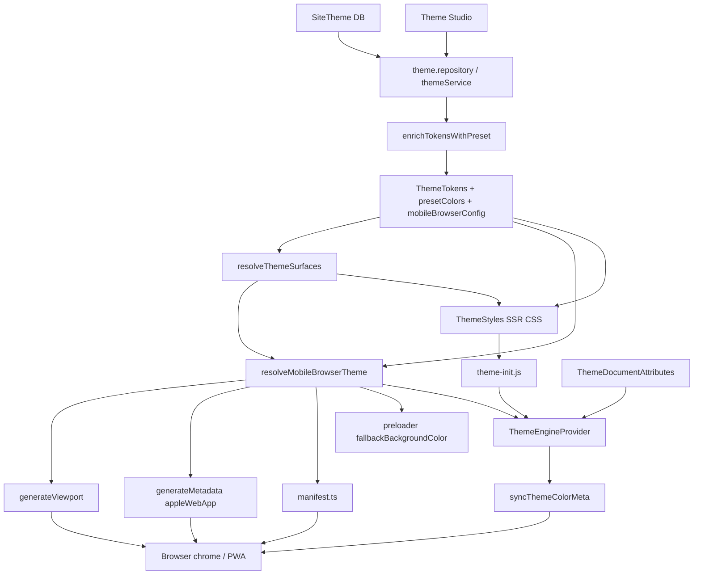

### Participant inventory

| Participant | Path | Role | Status |
|-------------|------|------|--------|
| `SiteTheme.mobileBrowserConfig` | Prisma + `src/schemas/theme.ts` | Persist chrome config | Verified |
| Theme Studio `MobileBrowserSection` | `theme-studio-sections.tsx` | Edit + preview only | Verified |
| `themeService.getPublished` | `theme.service.ts` | Cached enriched tokens | Verified |
| `enrichTokensWithPreset` | `preset-resolver.server.ts` | Inject `presetColors` | Verified |
| `resolveThemeSurfaces` | `theme-surfaces.ts` | Surface backgrounds L/D | Verified |
| `resolveMobileBrowserTheme` | `resolve-mobile-browser-theme.ts` | Pure chrome color resolution | Verified |
| `generateViewport` | `src/app/[locale]/layout.tsx` | SSR `theme-color` media pairs | Verified |
| `generateMetadata` | same | `appleWebApp.statusBarStyle`, manifest link | Verified |
| `manifest()` | `src/app/manifest.ts` | PWA `theme_color` / `background_color` | Verified |
| `loadLocaleLayoutData` | `load-locale-layout-data.ts` | Preloader fallback bg | Verified |
| `ThemeStyles` / `buildThemeCss` | theme CSS pipeline | SSR CSS vars | Verified |
| `generateThemeBootInlineScript` | `theme-boot.ts` | `__AZ_THEME_BOOT` | Verified |
| `theme-init.js` | `public/theme-init.js` | Pre-React appearance + Forced chrome | Verified |
| `ThemeDocumentAttributes` | `theme-document-attributes.tsx` | Non-appearance `data-*`; skips `data-theme*` | Verified |
| `ThemeWrapper` / next-themes | `theme-wrapper.tsx` | Class + storage; script disabled | Verified |
| `ThemeEngineProvider` | `theme-engine-provider.tsx` | Runtime appearance + chrome orchestration | Verified |
| `syncThemeColorMeta` | `appearance.ts` | Exclusive post-boot `theme-color` DOM writer | Verified |
| `applyPresetColors` | `colors.ts` | Client surface CSS vars | Verified |
| `applyThemeToDocument` | `theme-transition.ts` | class + `colorScheme` | Verified |
| Navigation / menu / motion | various | Documented non-writers of chrome | Verified (comments + no calls) |
| Immersive chrome fixtures | `preview/immersive-chrome/*` | Hardcoded viewport; isolated | Verified |
| Service worker | — | **Absent** | Verified |

### 0B — Dependency graph (distinct from ownership)

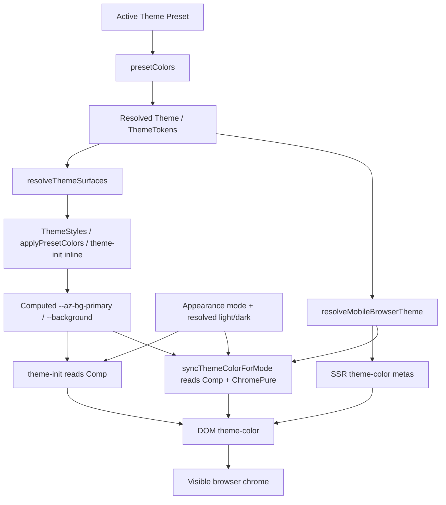

**Verified:** Chrome DOM content can depend on either pure resolver output **or** computed CSS (boot + runtime active color). These are parallel dependency edges, not a single chain. That violates Premises A–C (single provenance / projection consumers only).

---

## Phase 0.5 — Event Graph

Triggers (control) and required invalidation edges. Edge status uses existing Verified findings.

### Theme Published

```
Theme Published
        │
        ├──── invalidate caches          Present (CACHE_TAGS.theme on publish paths)
        ├──── regenerate SSR             Present (future requests hit resolvePublishedSiteTheme)
        ├──── update manifest            Present (next /manifest.webmanifest request)
        └──── live open tabs re-project  Missing (no push; tabs keep prior metas until reload/nav)
```

### Appearance Toggle

```
Appearance Toggle
        │
        ├──── resolve appearance         Present (client resolveAppearance)
        ├──── apply CSS / class / attrs  Present (applyAppearance path)
        ├──── sync chrome                Present (rAF syncThemeColorForMode)
        └──── persist storage            Present (next-themes setTheme → localStorage)
```

### Preset Change

```
Preset Change
        │
        ├──── resolve theme surfaces     Present (applyPresetColors / fetch preset)
        ├──── apply CSS                  Present
        ├──── sync chrome                Missing (I5 Fail — no syncThemeColorMeta)
        └──── update runtime ThemeState  Partial (visitor preset id in Engine; siteTheme tokens unchanged)
```

**Inferred:** Missing Preset Change → sync chrome is the Event Graph expression of invariant I5 Fail.

---

## Phase 0.6 — Data Flow vs Control Flow

### Data flow (what values move)

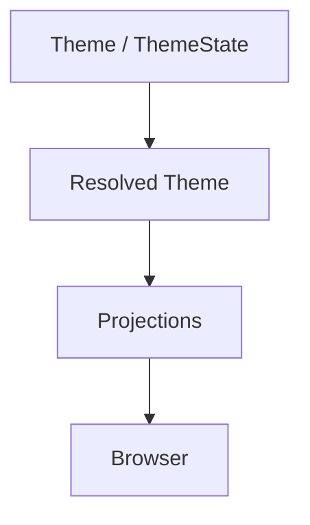

**Target data flow:** one Resolved Theme fans out to CSS / Browser / SSR / Manifest projections.

**Current data flow (Verified):** Parallel forks — resolver path **and** computed-CSS path both feed Browser Projection (Phase 0B).

### Control flow (what invokes what)

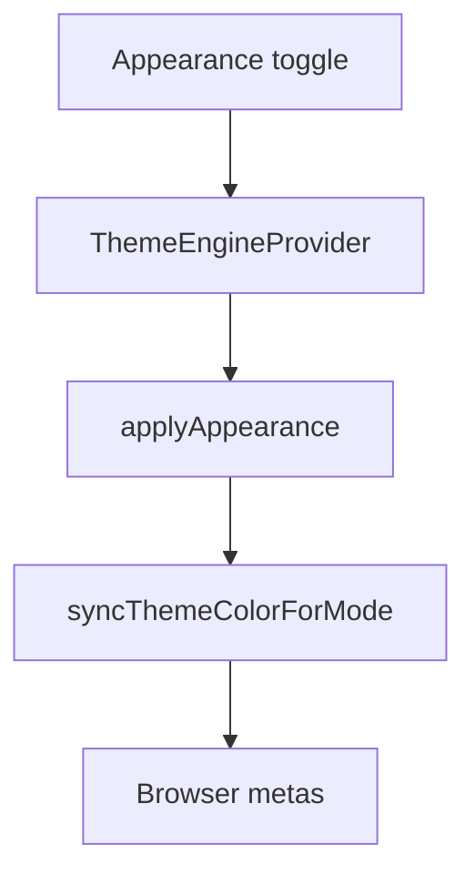

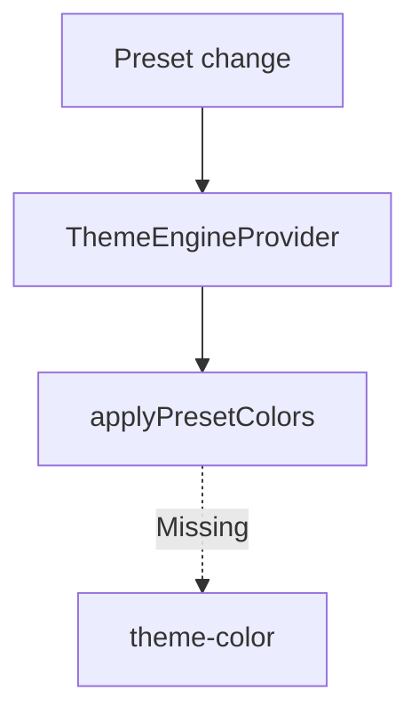

**Orchestration smell (Verified):** Control path for appearance re-reads computed CSS inside `syncThemeColorForMode` instead of using only Resolved Theme browser projection — control flow re-derives data that should already be resolved.

---

## Phase 0.7 — Appearance State Machine

| Current State | Event | Next State | Actions | Owner |
|---------------|-------|------------|---------|-------|
| System (resolved light or dark via OS) | OS scheme change | System (other resolved) | Media-scoped metas should follow OS; app class may update via matchMedia listeners if present | Browser medias + Engine (if listening) |
| System | Toggle light/dark | Forced opposite of resolved | `nextAppearanceMode` → `applyAppearance` → CSS + chrome collapse | ThemeEngineProvider |
| Forced Light | Toggle | Forced Dark | applyAppearance + sync chrome | ThemeEngineProvider |
| Forced Dark | Toggle | Forced Light | applyAppearance + sync chrome | ThemeEngineProvider |
| Forced * | Set System (personalization) | System | Restore media-scoped metas | ThemeEngineProvider |
| Any (SSR) | Cold load | System semantics in head only | Media pairs; Forced not encoded | `generateViewport` |
| Any (boot) | theme-init | Forced or System from storage | Class/attrs; Forced chrome from computed CSS | theme-init.js |
| Any | Hydrate catch-up | Same mode, metas re-projected | `syncThemeColorForMode` | ThemeEngineProvider |

Transitions today are **scattered** across theme-init, next-themes, and Engine (Phase 5 overlap)—not a single state machine owner.

---

## Phase 0.8 — Resolution Purity Audit

| Function | Pure | DOM | Storage | Cache | Globals | Browser APIs | Writes | Deterministic |
|----------|:----:|:---:|:-------:|:-----:|:-------:|:------------:|:------:|:-------------:|
| `resolveMobileBrowserTheme` | ✓ | ✗ | ✗ | ✗ | ✗ | ✗ | ✗ | ✓ |
| `resolveThemeSurfaces` | ✓ | ✗ | ✗ | ✗ | ✗ | ✗ | ✗ | ✓ |
| Server `resolveAppearance` | ✓ | ✗ | ✗ | ✗ | ✗ | ✗ | ✗ | ✓* |
| Client `resolveAppearance` | ✗ | ✗ | ✗ | ✗ | ✗ | matchMedia | ✗ | ✓ given OS |
| `readStoredAppearanceMode` | ✗ | ✗ | ✓ | ✗ | ✗ | ✗ | ✗ | ✓ given storage |
| `resolveStoredTheme` | ✗ | ✗ | ✓ | ✗ | ✗ | matchMedia | ✗ | ✓ given env |
| `enrichTokensWithPreset` | ✗ | ✗ | ✗ | async I/O | ✗ | ✗ | ✗ | ✓ given preset JSON |
| `readDocumentThemeBackground` | ✗ | ✓ | ✗ | ✗ | ✗ | getComputedStyle | ✗ | ✗ (cascade/timing) |
| `theme-init.js` (whole IIFE) | ✗ | ✓ | ✓ | ✗ | `window` | matchMedia, getComputedStyle | ✓ | ✗ |
| `syncThemeColorMeta` | ✗ | ✓ | ✗ | ✗ | ✗ | DOM | ✓ | ✓ given options |
| `applyPresetColors` | ✗ | ✓ | ✗ | ✗ | ✗ | ✗ | ✓ | ✓ given colors+mode |
| `generateViewport` | ✗ | ✗ | ✗ | themeService | ✗ | ✗ | via Next head | ✓ given published theme |

\*Server `resolveAppearance` for `system` defaults to light unless `prefersDark` passed — deterministic but **not** identical to client without that input (I4 Fail).

**Classification rule:** Pure + deterministic → Theme Engine resolution. Impure → projection adapters only (boot/DOM writers). **`readDocumentThemeBackground` and theme-init chrome sync must not remain resolution authorities.**

---

## Phase 0.9 — Runtime Consistency Assertions

Future automated / worksheet asserts (not implemented in this audit). Current status maps to Phase 10.

| Assertion | Current status |
|-----------|----------------|
| `browserProjection.activeThemeColor == ThemeState.browserProjection.active` | **Fail** — no unified ThemeState; Forced uses computed CSS |
| `browserProjection.themeColorLight/Dark == resolveMobileBrowserTheme(...).themeColorLight/Dark` for site tokens | **Pass** when that resolver is the sole input; **Fail** when visitor CSS overrides without re-resolve |
| `cssProjection.surface.background == ThemeState.surfaces.background` | **Pending** — visitor vs site can diverge by design today |
| `meta[name=theme-color].content == browserProjection` (Forced: active; System: media-scoped pair) | **Fail** after preset change without sync; **Pending** Observed on device paint |
| `manifest.theme_color == browserProjection.themeColorLight` at request time | **Pass** for emission path; not live Forced dark |
| `ThemeState.version` changes on publish / preset / appearance | **Fail** — no version field today |

These become the Phase 16 assert suite.

---

## Phase 1 — Sources of truth

| Authority | Classification | Evidence |
|-----------|----------------|----------|
| Published `SiteTheme` (+ `siteDefaultPresetId`) | **Authoritative** for SSR tokens | `themeService.getPublished`, `enrichTokensWithPreset` |
| `mobileBrowserConfig` | **Authoritative** when `syncWithTheme=false`; ignored for colors when true | `resolve-mobile-browser-theme.ts` |
| `presetColors` / `resolveThemeSurfaces(...).background` | **Derived** surface authority for chrome when sync on | Same + `theme-surfaces.ts` |
| Visitor localStorage preset colors | **Competing** with site preset for live CSS vars | `theme-init.js`, `applyPresetColors` |
| Appearance mode (`devi-theme-mode` / `admin-theme`) | **Authoritative** for Forced vs System chrome behavior | `theme-init.js`, `ThemeEngineProvider` |
| OS `prefers-color-scheme` | **Authoritative** only in System mode for resolved appearance + media metas | matchMedia + SSR media attributes |
| SSR `theme-color` metas | **Derived** first paint; **Competing** until overwritten | `generateViewport` |
| Computed `--az-bg-primary` / `--background` | **Competing** runtime input (boot + `readDocumentThemeBackground`) | `theme-init.js`, `appearance.ts` |
| `DEFAULT_*_SURFACES` / `#fafafa` | **Competing** fallbacks | surfaces, `syncThemeColorMeta`, manifest catch |
| Manifest `theme_color` | **Stale/Install-time** relative to live Forced dark | `manifest.ts` uses light only |
| Browser-held meta / chrome paint | **Derived** projection with **browser-owned** timing | Spec; Observed Pending |

**Conclusion (Inferred):** There is **not** one source of truth today. Competing authorities: site preset vs visitor preset; pure resolver vs computed CSS; SSR media pairs vs Forced collapse; manifest light vs runtime dark.

---

## Phase 2 — Lifecycle traces

> References: [Canonical Theme Timeline](#d--canonical-theme-timeline), [Synchronization Contract](#a--synchronization-contract), [Event Graph](#phase-05--event-graph).

### 2.1 Cold SSR

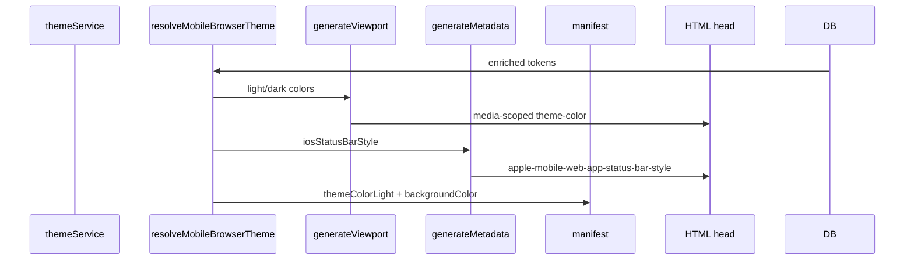

**Verified:** SSR does **not** read visitor appearance or Forced mode. Always media-scoped pairs from published theme.

### 2.2 First paint (no JS)

Browser applies matching `theme-color` media query (or browser default if catch omitted themeColor).  
**Status:** Verified for emission; Observed Pending for actual chrome tint per browser.

### 2.3 theme-init.js

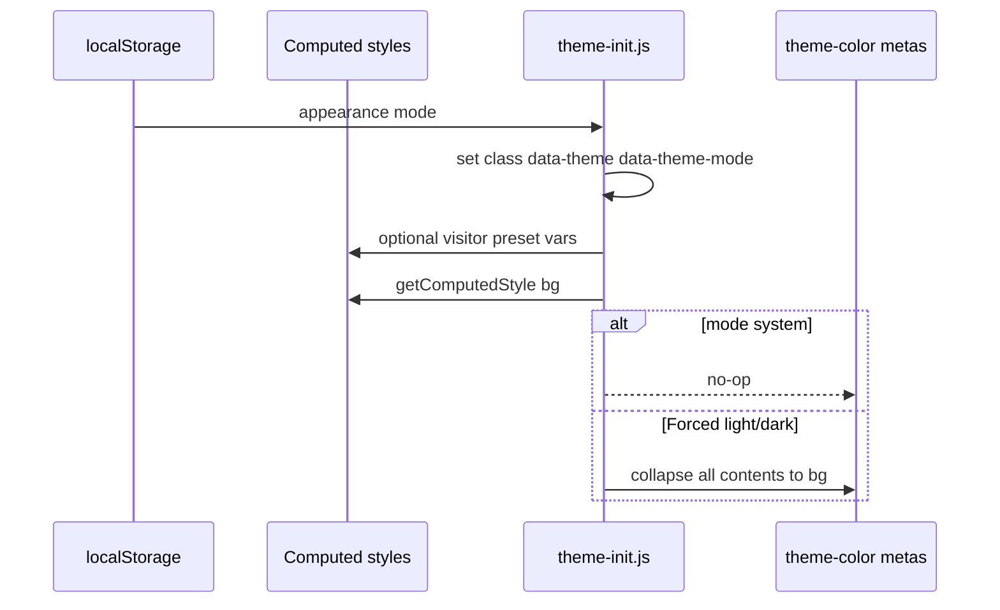

**Verified:** System = leave SSR metas. Forced = overwrite from computed CSS. Errors swallowed (`catch (e) {}`).

### 2.4 React hydration

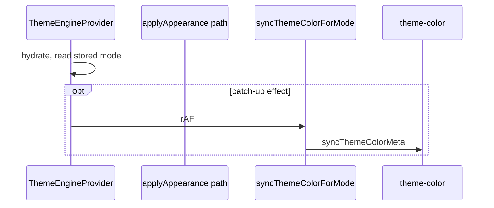

**Verified:** Catch-up skipped if `applyAppearance` already set `skipAppearanceCatchUpRef`.

### 2.5 Theme toggle

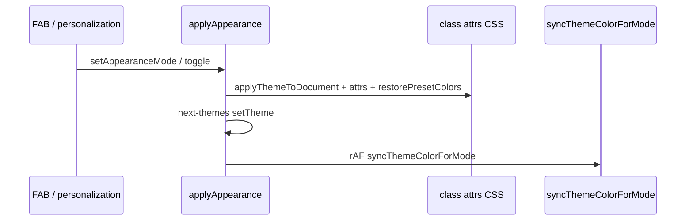

### 2.6 Preset change (catalog / user)

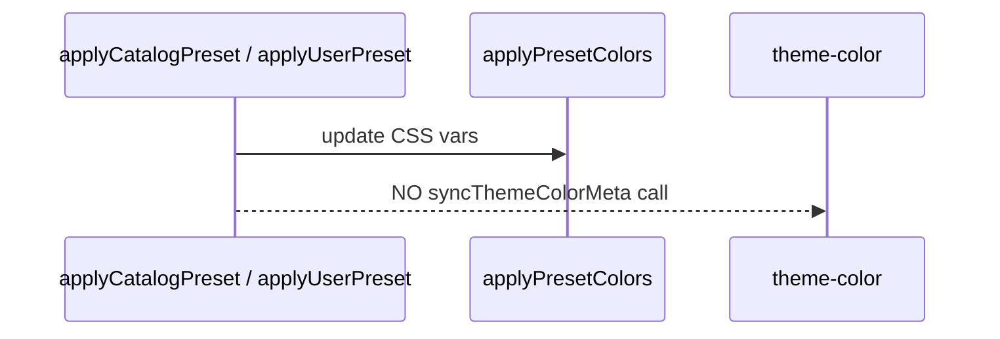

**Verified:** Preset apply does **not** call chrome sync. Chrome may lag until appearance toggle, hydrate catch-up, or reload. **Invariant I5 Fail.**

### 2.7 Route navigation (client)

Marketing routes share locale layout; page `generateMetadata` is SEO-only.  
**Verified:** No per-route `generateViewport` under `[locale]`.  
**Hypothesis:** Next.js head may re-reconcile SSR metas on soft navigation; Engine does not re-sync on navigation alone (no navigation chrome hook found).

### 2.8 Browser Back

**Hypothesis:** bfcache / head restore may revive SSR media metas while Forced appearance still active → stale chrome until catch-up or toggle. Needs Observed verification.

### 2.9 Refresh

Full pipeline restart: SSR → theme-init → hydrate catch-up. **Verified** by code structure.

### 2.10 Menu open

**Verified:** No `theme-color` writers in header/menu paths (grep). Non-participant.

### 2.11 Orientation / viewport

**Verified:** `viewportFit: "cover"` emitted once at locale layout. No chrome re-sync on orientation. Browser may re-evaluate media queries (System only).

### 2.12 PWA

Manifest light `theme_color` + `background_color` at install/request time. Independent of live Forced dark meta. **Verified.**

---

## Phase 2.5 — State Ownership Timeline

> References: [Canonical Theme Timeline](#d--canonical-theme-timeline), [Appearance State Machine](#phase-07--appearance-state-machine). Ownership transfers are hand-offs along that timeline.

### Cold load + Forced appearance (primary conflict path)

| Step | Owner | Hand-off trigger | Overwrite risk | Stale-state risk |
|------|-------|------------------|----------------|------------------|
| SSR HTML | `generateViewport` | Response delivered | Low at emit | High if visitor Forced ≠ OS |
| Browser parses | Browser | Parse complete | Browser may paint from media query | Media may not match Forced app |
| theme-init.js | Temporary (Forced) | beforeInteractive | Overwrites SSR contents with computed bg | High if CSS vars not yet visitor-correct |
| ThemeEngineProvider hydrate | Runtime | `hydrated` + rAF | Overwrites boot metas | Medium (rAF vs CSS settle) |
| Appearance toggle | ThemeEngineProvider | User action | Overwrites | Low if sync after colors |
| Preset change | CSS vars only; **chrome owner unchanged / idle** | Preset apply | None on meta | **High** — chrome not invalidated |
| Route navigation | Next.js Head ↔ idle Engine | Soft nav | Head may restore SSR | **Hypothesis: High** |
| Hydration catch-up | ThemeEngineProvider | Effect when not skipped | Overwrites | Medium |

### System appearance path

| Step | Owner | Notes |
|------|-------|-------|
| SSR | `generateViewport` | Media pairs authoritative for chrome selection |
| theme-init | No-op on metas | Verified early return when `mode === "system"` |
| Engine | Restores media-scoped light/dark via `syncThemeColorMeta` | Verified |

### Ownership-transfer smells (Inferred)

1. Forced path: SSR owns wrong semantic (OS media) → temporary boot owner corrects from **computed** CSS → runtime owner mixes resolver + computed.  
2. Preset change: CSS owner updates; chrome owner does not transfer or fire.  
3. Navigation: possible Head reclaim without Engine hand-back (**Hypothesis**).

---

## Phase 3 — Route comparison (no reference route)

| Route | SSR chrome owner | `generateViewport` | Runtime ThemeEngine | Page metadata | Code claim |
|-------|------------------|--------------------|---------------------|---------------|------------|
| Home | `[locale]/layout` | Yes (shared) | Yes | SEO `pageKey: home` | SSR chrome identity = locale |
| Landing (home fallback) | same | same | Yes | same as Home | same |
| Blog index/post | same | same | Yes | SEO only | same |
| Products / Product | same | same | Yes | SEO only | same |
| Collections | same | same | Yes | SEO only | same |
| CMS pages / `[slug]` | same | same | Yes | SEO only | same |
| Search | same | same | Yes | static title | same |
| Admin | root boot only | **No** | **No** | admin metadata | Separate population |
| Coming-soon | root boot | **No** | No locale engine | static | Separate |
| Preview page/preset | manual viewport meta | No Next themeColor | Preview bridge | noindex | Separate |
| Immersive fixtures | fixture `generateViewport` | Hardcoded | No storefront engine | fixture | Isolated |

**Rule applied:** No route classified correct.  
**Verified:** Marketing routes share identical SSR chrome emission path.  
**Observed:** Device differences across routes — **Pending** (worksheet below).

### Device worksheet (Pending)

For each route under test: View Source `theme-color` media attrs; Elements live `content`; `data-theme` / `data-theme-mode`; computed `--az-bg-primary`; Forced vs System; note OS scheme.

---

## Phase 4 — Mutation inventory

| ID | Mutator | Mutates | Trigger | Overwrite? |
|----|---------|---------|---------|------------|
| A1 | `generateViewport` | `theme-color` metas (SSR) | Locale request | Yes → A2/A3 |
| A2 | `theme-init.js` `syncThemeColorMetaFromComputed` | meta `content` or create | beforeInteractive Forced | Yes → A3 |
| A3 | `syncThemeColorMeta` via Engine | meta `content` or create | Appearance apply + hydrate rAF | Later A3 |
| A4/A5 | Immersive fixtures | viewport themeColor | Fixture routes only | Isolated |
| B1 | `manifest.ts` | JSON theme_color / background_color | Manifest request | Not DOM |
| C1 | `generateMetadata` | apple status bar | Locale SSR | Remount/nav |
| D1 | theme-init | class, colorScheme, data-theme* | Boot | Yes |
| D2 | `applyThemeToDocument` | class, colorScheme | Engine / admin toggle | Yes |
| D3 | `syncThemeDataAttributes` | data-theme* | Engine | Yes |
| D4 | next-themes `setTheme` | class + localStorage | Engine / admin | Competes D1/D2 |
| E1 | semantic-fallback.css | CSS vars | Stylesheet | Overridden |
| E2 | ThemeStyles SSR | surface CSS | Locale render | Overridden by inline |
| E3/E4 | `applySurfaceCssVars` / `applyPresetColors` | inline CSS vars | Client preset/appearance | Yes |
| E5 | theme-init visitor bootstrap | inline CSS vars | Boot | Yes |

**Exclusive theme-color writers (Verified):** A1, A2, A3 (+ fixture A4/A5).

---

## Phase 5 — Ownership matrix / duplicate elimination

| Component | Reads | Writes | Should own? (audit rec.) |
|-----------|-------|--------|--------------------------|
| `resolveMobileBrowserTheme` | tokens, surfaces | nothing (pure) | Keep as pure projection input |
| `resolveThemeSurfaces` | presetColors | nothing | Keep shared surface resolve |
| `generateViewport` | resolver | SSR theme-color | Keep first-paint emission |
| `generateMetadata` (chrome bits) | resolver | apple status | Keep or fold into chrome emit |
| `manifest.ts` | resolver | PWA colors | Keep install projection |
| `theme-init.js` | storage, CSS, SSR attrs | appearance + Forced meta | **Smell** — justify or fold |
| `syncThemeColorMeta` | options, CSS, defaults | theme-color DOM | Keep single DOM mutator |
| `ThemeEngineProvider` | siteTheme, storage | orchestrates appearance+chrome | Keep orchestrator |
| `readDocumentThemeBackground` | computed CSS | — | **Smell** as chrome SoT |
| next-themes | storage | class + storage | **Smell** overlap with Engine |
| `applyThemeToDocument` | — | class | Merge with single appearance apply |
| Client `resolveAppearance` | matchMedia | — | Merge with server API |
| Server `resolveAppearance` | prefersDark? | — | Merge |
| `resolveStoredTheme` | storage | — | Merge into one storage reader |
| Theme Studio resolve | tokens | preview UI only | Keep as consumer |

### Unjustified / weakly justified overlaps

| Overlap | Why it exists (evidence) | Justified? |
|---------|--------------------------|------------|
| theme-init meta sync vs `syncThemeColorMeta` | Forced first-paint before React ([docs claim](./browser-chrome-theme-sync.md) + code) | Partially — problem real; dual implementation is Smell |
| Computed CSS vs resolver for chrome color | Boot cannot import TS resolver; Engine uses both | Smell — computed should not be primary |
| Client vs server `resolveAppearance` | `window` vs SSR | Smell — shared semantics missing |
| `resolveStoredTheme` vs `readStoredAppearanceMode` | Historical parallel helpers | Unjustified Smell → consolidate |
| theme-init `skipSurface` vs `shouldSkipPresetSurfaces` | Intentional mirror comment | Smell — duplicated rule |
| next-themes class vs `applyThemeToDocument` | Library + custom path | Smell — dual class writers |
| Manifest light-only vs dual theme-color | PWA API single theme_color | Platform constraint (Keep with documented limit) |

---

## Phase 6 — Input provenance + active preset

### Hop-by-hop

| Hop | Input | Output | Same preset? | Same appearance? | Cache |
|-----|-------|--------|--------------|------------------|-------|
| DB `SiteTheme` | published row | raw theme | siteDefaultPresetId | N/A (no Forced) | `unstable_cache` 3600s + tag |
| `enrichTokensWithPreset` | siteDefaultPresetId | `presetColors` | Yes if load ok | N/A | preset JSON load |
| `resolveThemeSurfaces` | presetColors + mode | background hex | Uses **that** mode's surfaces | Explicit mode arg | None |
| `resolveMobileBrowserTheme` | tokens | light+dark chrome | From tokens.presetColors | Resolves **both** L/D always | None |
| SSR viewport | resolver | two metas | Site published | OS media, not visitor | Request `cache()` |
| theme-init Forced | computed CSS | meta content | **Visitor** may differ | Forced stored | localStorage |
| Engine sync | resolver **+** computed | meta content | siteTheme prop (published/preview) | Client appearance | React state/refs |

**Verified divergence:** SSR chrome uses **site** `presetColors`. Runtime Forced chrome may use **visitor** computed surfaces. Same pipeline name; different inputs.  
**Verified:** `themeService` cache revalidate 3600 — stale published theme possible until tag invalidation.  
**Timestamp identity:** No generation id on chrome resolution (**Verified** absence).

### Visitor vs site preset

**Verified:** `applyCatalogPreset` / `applyUserPreset` update DOM colors without updating `siteTheme` tokens used by `resolveMobileBrowserTheme(siteTheme)`. Even when chrome eventually syncs, `lightColor`/`darkColor` options may still be **site** surfaces while `color` (computed) is **visitor**.

---

## Phase 6.5 — CSS variable provenance

```
Site/visitor preset colors
  → resolveThemeSurfaces
  → surfaceCssBlock (SSR ThemeStyles) OR applySurfaceCssVars / theme-init inline
  → --az-bg-primary, --background (and aliases)
  → getComputedStyle
  → theme-init syncThemeColorMetaFromComputed / readDocumentThemeBackground
  → theme-color content
```

| Writer | When | Wins over |
|--------|------|-----------|
| `semantic-fallback.css` | Always | Baseline |
| ThemeStyles SSR `html` / `html.dark` | Locale render | Fallback |
| theme-init visitor `#az-visitor-theme` / inline | Boot if visitor colors | SSR (inline) |
| `applyPresetColors` | Appearance/preset client | Prior inline |
| `clearPresetColorOverrides` | Reset | Restores stylesheet |

**Chrome-relevant vars:** `--az-bg-primary`, `--background` (Verified read order).  
**Smell:** Computed values used as chrome primary when Theme Engine already has semantic surfaces / resolver output.

---

## Phase 7 — Hidden caches

| Cache | Owner | Invalidation | Refresh trigger | Stale risk |
|-------|-------|--------------|-----------------|------------|
| `unstable_cache` published theme | themeService | CACHE_TAGS.theme | Publish / revalidate | Medium (3600s) |
| React `cache()` resolvePublishedSiteTheme | Server request | Request end | New request | Low |
| `devi-theme-mode` localStorage | next-themes / Engine | setTheme | Appearance change | Low |
| Visitor preset localStorage | preset-session / theme-init | clear / reset | Preset apply | High vs SSR |
| `skipAppearanceCatchUpRef` | ThemeEngineProvider | Cleared after skip | applyAppearance | Low |
| `visitorEffectsBootRef` | ThemeEngineProvider | Mount once | — | Medium if mid-session needs |
| next-themes internal | Library | setTheme | — | Medium (class races) |
| Inline CSS on `<html>` | applyPresetColors / theme-init | clearVisitorThemeDomOverrides | Reset cookie | High if uncleared |
| DOM theme-color nodes | Next head + writers | In-place content updates | Sync paths | High on nav (**Hypothesis**) |
| Manifest HTTP cache | Browser/CDN | Cache headers | Remanifest | Install-time stale |
| Service worker | — | N/A | **Absent** | None |
| `theme-preview` cookie | Studio / actions | Delete on publish | Preview toggle | Draft SSR theme |
| `theme-reset` cookie | publish / demo | Cleared by Engine | Next visit | Clears visitor DOM |

---

## Phase 8 — Asynchronous boundaries

| Boundary | Sync | Async | Can race? | Chrome before deps ready? |
|----------|------|-------|-----------|---------------------------|
| SSR | ✓ | | No | N/A |
| theme-init IIFE | ✓ | | With CSS parse order | **Yes** — reads computed after optional visitor write; if bg empty, skips (**Verified**) |
| Hydration | | ✓ | Yes | Catch-up waits `hydrated` + `siteTheme` |
| Hydrate catch-up rAF | | ✓ | Yes | Intentional settle; still may race paint |
| Preset fetch | | ✓ | Yes | Colors apply; chrome **not** updated (**Verified**) |
| Appearance rAF sync | | ✓ | Yes | Designed after color restore |
| Route transition | | ✓ | Yes | No chrome sync hook (**Verified** absence) |
| Next head reconcile | | ✓ | **Hypothesis** | May restore SSR without Engine |

---

## Phase 9 — Application state vs browser state

> References: [Theme State Contract](#b--theme-state-contract), [Projection Architecture](#c--projection-architecture), [Synchronization Contract](#a--synchronization-contract).

### Application state

- Preset (site + visitor), appearance mode, resolved appearance, surfaces, tokens, CSS variables, `data-theme` / `data-theme-mode`, html class

### Browser state

- `theme-color` metas, Apple status bar meta, manifest `theme_color` / `background_color`, splash, visible address/status chrome

### Projection check

| Case | Projection intact? | Status |
|------|--------------------|--------|
| System + site preset + no visitor override | Intended yes via media metas | Verified emission; Observed Pending |
| Forced + site preset | After boot/engine, metas collapse to active | Verified code; first paint may mismatch SSR |
| Visitor preset without appearance change | App surfaces change; browser meta may not | **Fail Verified** |
| Manifest vs Forced dark page | Install light theme_color | **Fail as live projection** (install-time API) |
| JS disabled | SSR media only | Partial projection |
| Admin | No viewport theme-color | Separate app |

**Conclusion (Verified):** Browser state is **not always** a projection of current application state.

---

## Phase 10 — Invariants check

> References: [Synchronization Contract](#a--synchronization-contract), [Runtime Consistency Assertions](#phase-09--runtime-consistency-assertions). Invariants operationalize the Sync Contract; asserts will automate them.

| ID | Invariant | Result | Evidence |
|----|-----------|--------|----------|
| I1 | Chrome colors from currently active resolved theme | **Fail** | Computed CSS + defaults; visitor vs site; SSR ignores Forced |
| I2 | SSR and runtime identical for identical inputs | **Fail** | SSR never receives Forced appearance; runtime collapses metas |
| I3 | No runtime independent browser color computation | **Fail** | `readDocumentThemeBackground` / theme-init computed path; DEFAULT surfaces in `syncThemeColorMeta` |
| I4 | Appearance resolution identical server/client | **Fail** | Two `resolveAppearance` APIs; server defaults system→light without prefersDark |
| I5 | Preset changes invalidate browser chrome | **Fail** | `applyCatalogPreset` / `applyUserPreset` omit sync |
| I6 | No chrome color cache beyond one appearance cycle | **Pending / Partial** | No dedicated chrome cache object; DOM metas + manifest HTTP act as caches; nav stale **Hypothesis** |

---

## Phase 11 — Failure recovery

| Failure | Fallback | Browser chrome | Recovery |
|---------|----------|----------------|----------|
| Preset unavailable (`loadPresetJson` null) | Tokens without presetColors → DEFAULT surfaces | Default `#fafafa` / `#020408` chrome | Next successful enrich |
| Invalid `mobileBrowserConfig` | Parse/defaults / schema on save | DEFAULT_MOBILE_BROWSER_CONFIG | Re-save |
| Missing CSS variables | theme-init no-op if `!bg`; Engine uses resolver then DEFAULT | May keep SSR or defaults | Later sync when vars exist |
| Hydration skipped | Boot may have Forced fix; no Engine catch-up | Boot state sticks | Full reload |
| JS disabled | SSR media pairs only | OS-driven media; no Forced | N/A |
| theme-init exception | Swallowed empty catch | SSR metas unchanged | Engine may still sync |
| Manifest catch | `#fafafa` / `#fafafa` | Install wrong colors | Fix theme resolve |
| generateViewport catch | **No themeColor** | Browser default chrome | Fix theme resolve |
| generateMetadata catch | `{}` | No apple status | Fix theme resolve |
| Storage unavailable | theme-init / readers try/catch | SSR / defaults | — |

**Smell:** Viewport catch removes theme-color entirely; manifest catch hardcodes light neutrals — different failure colors (**Verified**).

---

## Phase 12 — Evidence discipline

This document uses Verified / Observed / Inferred / Hypothesis only.  
**Not claimed:** “Theme Color is correct,” “Home works,” or any route as reference.  
**Observed Pending:** All device chrome tint cells; soft-navigation meta reclaim; bfcache behavior.

Automated tests present (do not prove end-to-end chrome):

- `src/lib/theme/__tests__/resolve-mobile-browser-theme.test.ts`
- `src/features/theme/engine/__tests__/sync-theme-color-meta.test.ts`

---

## Phase 13 — Root-cause tree

```
Browser Chrome Incorrect / Theme Sync Inconsistent
├── Theme Preset
│   ├── Verified: visitor preset updates CSS without chrome invalidation (I5)
│   └── Verified: SSR chrome uses site presetColors; runtime may use visitor computed
├── Theme Resolution
│   └── Verified: resolveMobileBrowserTheme pure; consumers mix in other inputs
├── Appearance Resolution
│   ├── Verified: duplicate client/server resolveAppearance (I4)
│   └── Verified: SSR viewport ignores Forced appearance
├── CSS Variable Provenance
│   └── Verified: computed --az-bg-primary used as chrome primary (I3)
├── Ownership Transfer
│   ├── Verified: SSR → theme-init → Engine hand-offs for Forced
│   └── Hypothesis: Next head reclaim on navigation without Engine
├── Hidden Cache / Stale Input
│   ├── Verified: themeService 3600s cache
│   └── Verified: visitor localStorage vs published tokens
├── Asynchronous Race
│   ├── Verified: rAF sync after appearance
│   └── Verified: theme-init skips if computed bg empty
├── Unjustified / Redundant Subsystem
│   ├── Verified: dual meta sync implementations
│   ├── Verified: dual appearance storage readers
│   └── Verified: next-themes + applyThemeToDocument class dual write
├── SSR Metadata
│   └── Verified: media pairs only; catch drops themeColor
├── Runtime Sync
│   └── Verified: exclusive writers exist but inputs compete
├── Route Lifecycle
│   ├── Verified: marketing SSR chrome identical across routes
│   └── Hypothesis: observed route diffs are browser heuristics or timing (see immersive docs as claims)
└── Browser Limitation
    ├── Verified: single manifest theme_color (light chosen)
    └── Observed Pending: Theme Color paint latency / immersive heuristics
```

---

## Phase 14 — Architectural verdict

### Verified

1. Marketing SSR `theme-color` is owned solely by `[locale]/layout` `generateViewport` via `resolveMobileBrowserTheme`.
2. Post-boot DOM `theme-color` writers are only `theme-init.js` (Forced) and `syncThemeColorMeta` (Engine).
3. Preset apply does not sync chrome metas.
4. Forced appearance is not represented in SSR viewport (always OS media pairs).
5. Runtime chrome active color prefers computed CSS over pure resolver.
6. Duplicate appearance resolution APIs exist (server vs client).
7. No service worker in repo.
8. Admin lacks `generateViewport` / ThemeEngine chrome path.
9. Manifest uses light theme_color only.

### Architecture Smells

- Competing authorities (site vs visitor; resolver vs computed CSS).
- Ownership-transfer Forced pipeline (SSR wrong semantic → boot patch → runtime patch).
- Dual chrome sync implementations (theme-init vs syncThemeColorMeta).
- Dual appearance resolvers and storage readers.
- Dual html class writers (next-themes + applyThemeToDocument).
- I1–I5 Failures.
- Computed CSS as de facto chrome SoT.
- Unjustified overlap without unique responsibility proofs (Phase 14.5).

### Root Causes (evidence-backed)

1. **No single provenance chain** from active theme → browser; Forced and visitor paths fork.
2. **Chrome invalidation incomplete** — appearance syncs; preset changes do not.
3. **SSR cannot express Forced appearance**, requiring client correction that depends on CSS timing.
4. **Semantic duplication** — appearance, surfaces, and chrome colors resolved in multiple places with divergent inputs.
5. **Browser/install APIs** (manifest single color; Theme Color paint) amplify architecture gaps but are not the sole cause of meta/DOM inconsistency.

### Recommended Simplification (high level)

Collapse to: **one Theme Engine resolution of appearance + surfaces + browser projection**, emitted by SSR for first paint, projected by one runtime writer after hydration, with preset/appearance both invalidating chrome — **without** computed CSS as primary chrome SoT. Details in Phase 14.5 / 15.

---

## Phase 14.5 — Architecture Justification Audit

| Component | Original purpose | Still required? | Another layer solving it? | Duplicates? | Move / consume / remove? | Rec. |
|-----------|------------------|-----------------|---------------------------|-------------|--------------------------|------|
| `resolveMobileBrowserTheme()` | Pure chrome colors from config+surfaces | Yes (projection input) | Surfaces alone if config removed | No if sole entry | Keep pure; single entry | **Keep** |
| `resolveThemeSurfaces()` | Shared L/D surfaces | Yes | Many callers already | Shared OK | Keep shared | **Keep** |
| `mobileBrowserConfig` | Manual chrome overrides | Only if product needs overrides | syncWithTheme true ignores colors | Studio+schema | Keep config; default sync | **Keep** (narrow) |
| `generateViewport()` | First-paint theme-color + viewport-fit | Yes (no JS) | None for first paint | Immersive fixtures separate | Keep emitter as consumer of Resolved | **Keep** |
| `generateMetadata()` apple status | iOS status bar | Yes for iOS PWA | Could share chrome emit helper | — | Keep or Merge into chrome emit helper | **Merge** helper |
| `manifest.ts` | PWA install colors | Yes for install | Page theme-color ≠ install API | light-only vs dual meta | Keep as projection; document limit | **Keep** |
| `theme-init.js` (appearance) | Pre-hydration FOUC prevention | Yes roughly | next-themes script disabled for this | resolveAppearance parallel | Keep minimal boot OR Replace with one boot module | **Replace** (thin boot) |
| `theme-init.js` (chrome sync) | Forced fix before React | Problem still exists | Engine syncThemeColorMeta | Dual meta sync | Prefer Engine-owned projection data in boot payload | **Merge/Replace** |
| `syncThemeColorMeta()` | In-place meta updates | Yes (Next head safety) | theme-init Forced path | Dual | Keep as **only** DOM mutator | **Keep** |
| `ThemeEngineProvider` | Runtime theme orchestration | Yes | Fragments elsewhere | Overlapping with next-themes | Keep; sole runtime owner post-hydration | **Keep** |
| `ThemeDocumentAttributes` | SSR non-appearance data-* | Yes | reconcileSiteHtmlAttributes | Partial overlap | Keep; skip appearance OK | **Keep** |
| `applyPresetColors()` | Visitor/site colors on DOM | Yes for personalization | ThemeStyles SSR | theme-init bootstrap | Keep; must trigger chrome invalidate | **Keep** (+ wire I5) |
| next-themes / `ThemeWrapper` | Appearance storage + class | Partially | Engine already applies class | Dual class + storage | Replace with Engine-owned storage or Merge | **Replace/Merge** |
| `applyThemeToDocument` | class + colorScheme | Overlaps next-themes | next-themes enableColorScheme | Yes | Merge into one apply | **Merge** |
| Client `resolveAppearance` | System→resolved | Yes | Server copy | Yes | Single shared module | **Merge** |
| Server `resolveAppearance` | SSR appearance attrs | Yes | Client copy | Yes | Single shared | **Merge** |
| `resolveStoredTheme` | Read stored mode | Overlap | `readStoredAppearanceMode` | Yes | Merge | **Remove** (fold) |
| `readDocumentThemeBackground` as chrome SoT | Mid-transition color | Convenience | Resolver semantic colors | Competing SoT | Consumer of Engine resolved color only | **Replace** usage |
| Preloader `fallbackBackgroundColor` | Loading paint | UX | Not chrome meta | Uses resolver | Keep as paint consumer | **Keep** |
| Immersive fixtures viewport | Device testing | Dev only | — | Hardcoded | Keep out of storefront | **Keep** (isolated) |
| CapabilityInit / nav motion | Explicit non-owners | Yes as guards | — | — | Keep non-writers | **Keep** |

### Architecture Reduction Report

| Component | Keep | Merge | Replace | Remove | Evidence |
|-----------|:----:|:-----:|:-------:|:------:|----------|
| `resolveMobileBrowserTheme` | ✓ | | | | Sole pure chrome mapping; tests exist |
| `resolveThemeSurfaces` | ✓ | | | | Shared surface authority |
| `mobileBrowserConfig` | ✓ | | | | Product overrides when sync off |
| `generateViewport` | ✓ | | | | Required for first paint without JS |
| Apple status in `generateMetadata` | | ✓ | | | Same chrome emit helper as viewport |
| `manifest.ts` | ✓ | | | | Required PWA API; light-only is platform |
| `ThemeEngineProvider` | ✓ | | | | Needed runtime owner |
| `syncThemeColorMeta` | ✓ | | | | Needed in-place DOM mutator |
| `ThemeDocumentAttributes` | ✓ | | | | Non-appearance SSR attrs |
| `applyPresetColors` | ✓ | | | | Visitor surfaces; must gain chrome invalidate |
| Preloader fallback | ✓ | | | | Paint only; uses resolver |
| theme-init appearance boot | | | ✓ | | Replace with single boot contract from Engine payload |
| theme-init chrome sync | | ✓ | ✓ | | Merge into boot applying **resolved** colors from payload, not computed SoT |
| next-themes as class owner | | ✓ | ✓ | | Storage OK or replace; class ownership → Engine |
| `applyThemeToDocument` | | ✓ | | | Fold into single appearance apply |
| Duplicate `resolveAppearance` | | ✓ | | | One shared function |
| `resolveStoredTheme` | | | | ✓ | Fold into `readStoredAppearanceMode` |
| Computed CSS as chrome primary | | | ✓ | | Use Engine resolved surface/chrome colors |
| Second meta writer conceptual role | | ✓ | | | One writer API; boot calls same semantics |

**Objective:** Minimize sync architecture while preserving behavior. Every Keep cites unique responsibility above.

### Elimination Criteria (measurable)

A subsystem survives (**Keep**) **only if** all of the following hold:

1. **One unique responsibility**
2. **No duplicated decisions** (does not choose appearance / surfaces / browser colors independently of ThemeState)
3. **No duplicated ownership** (not a second writer for the same artifact)
4. **Deterministic inputs**
5. **Deterministic outputs**
6. **Required by platform** OR **required for first paint without JS**

Otherwise the only allowed outcomes are **Merge**, **Replace**, or **Delete** — never “keep because useful.”

### Elimination checklist rescoring (addendum)

Existing Reduction Report recommendations retained unless a Keep fails the checklist (then upgraded). Technical findings unchanged.

| Component | Unique resp. | No dup decisions | No dup ownership | Det. in | Det. out | Platform / first paint | Checklist | Final |
|-----------|:------------:|:----------------:|:----------------:|:-------:|:--------:|:----------------------:|-----------|-------|
| `resolveMobileBrowserTheme` | ✓ | ✓ | ✓ | ✓ | ✓ | ✓ (resolution) | Pass | **Keep** |
| `resolveThemeSurfaces` | ✓ | ✓ | ✓ | ✓ | ✓ | ✓ | Pass | **Keep** |
| `mobileBrowserConfig` | ✓ | ✓ | ✓ | ✓ | ✓ | config | Pass | **Keep** |
| `generateViewport` | ✓ | ✓* | ✓ SSR | ✓† | ✓ | First paint | Pass* | **Keep** |
| `manifest.ts` | ✓ | ✓ | ✓ | ✓ | ✓ | Platform PWA | Pass | **Keep** |
| `ThemeEngineProvider` | ✓ | Partial today | Partial today | — | — | Runtime owner | Fail today; **Keep** as *target* sole owner after consolidation | **Keep** |
| `syncThemeColorMeta` | ✓ | ✓ if options from ThemeState | Fail while theme-init also writes | ✓ given opts | ✓ | DOM adapter | Fail ownership today → remains **Keep** only as *sole* writer after Merge boot | **Keep** |
| `ThemeDocumentAttributes` | ✓ | ✓ | ✓ | ✓ | ✓ | First paint attrs | Pass | **Keep** |
| `applyPresetColors` | ✓ | ✓ | ✓ CSS | ✓ | ✓ | Personalization | Pass (+ must wire chrome invalidate) | **Keep** |
| Preloader fallback | ✓ | ✓ | ✓ | ✓ | ✓ | UX paint | Pass | **Keep** |
| Immersive fixtures | ✓ | ✓ | isolated | ✓ | ✓ | Dev | Pass | **Keep** |
| CapabilityInit / nav | ✓ non-writer | ✓ | ✓ | — | — | Guard | Pass | **Keep** |
| theme-init appearance | Partial | Dup resolve | Dup class | ✗ | ✗ | Boot FOUC | Fail | **Replace** |
| theme-init chrome sync | ✗ | Dup | Dup writer | ✗ | ✗ | Forced FOUC | Fail | **Merge/Replace** |
| next-themes class owner | ✗ | Dup | Dup | — | — | Storage only useful | Fail | **Replace/Merge** |
| `applyThemeToDocument` | ✗ | Dup | Dup | ✓ | ✓ | — | Fail | **Merge** |
| Duplicate `resolveAppearance` | ✗ | Dup | — | Partial | Partial | — | Fail | **Merge** |
| `resolveStoredTheme` | ✗ | Dup | — | — | — | — | Fail | **Remove** |
| Computed CSS as chrome SoT | ✗ | Dup | — | ✗ | ✗ | — | Fail | **Replace** |
| Apple status emit | Partial | — | — | ✓ | ✓ | Platform | Fold | **Merge** helper |

\*SSR viewport still ignores Forced appearance (I2) — Keep as emitter, not as complete ThemeState projection.  
†Deterministic given published theme only; not given full ThemeState (visitor Forced).

No Keep was upgraded solely by checklist failure where the Reduction Report already marked Merge/Replace/Remove. `ThemeEngineProvider` / `syncThemeColorMeta` Keep means **unique target role after reduction**, not endorsement of current dual-writer reality.

---

## Phase 15 — Refactoring plan (no code in this phase)

### Target architecture (from justified survivors)

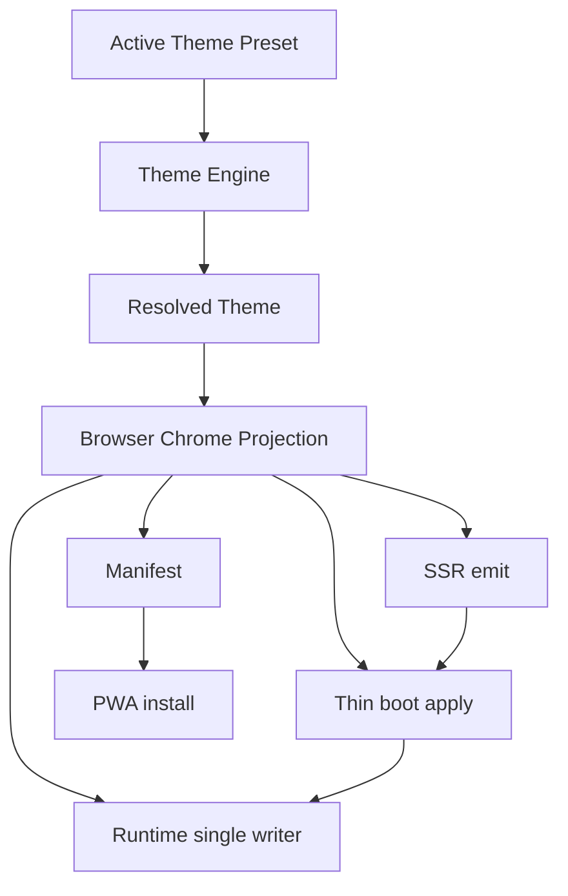

Layers:

1. **Theme Preset + SiteTheme config** → Theme Engine  
2. **Resolved Theme** (appearance, surfaces, browser projection colors) — single resolve  
3. **Browser Chrome Sync** — pure projection + emit/apply adapters only:
   - SSR (`generateViewport` / apple meta)
   - Manifest
   - Thin boot (applies Forced projection without re-deriving from computed CSS as SoT)
   - Runtime (`syncThemeColorMeta` only DOM mutator; Engine sole post-hydration owner)

### Constraints (normative for future implementation)

1. Every browser-theme value MUST have a **single provenance chain** from the active theme to the browser.  
2. Every lifecycle transition MUST have **exactly one runtime owner after hydration** (`ThemeEngineProvider`).  
3. No component may resolve the same semantic concept twice (appearance, surfaces, browser colors, theme state).  
4. **Computed CSS MUST never be a primary source of truth** when the Engine has the semantic value.  
5. Browser metadata MUST be a **projection** of resolved application state, never an independent state machine.  
6. **Removing a component is preferred** when unique responsibility cannot be justified.  
7. Preset changes and appearance changes MUST both invalidate/re-project chrome.  
8. Caches MUST declare invalidation; async boundaries MUST not read unset deps.  
9. Unjustified overlaps from Phase 5 / 14.5 MUST be consolidated (not re-labeled “exclusive writers” without reduction).

### Suggested consolidation order (design only)

1. Unify appearance resolution + storage read APIs.  
2. Extend Resolved Theme to include browser projection for Forced + System (SSR can emit Forced when known; cookie/header strategy separate design).  
3. Make `syncThemeColorMeta` the only meta mutator; boot calls shared logic or applies payload colors.  
4. Wire preset apply → chrome re-project.  
5. Demote next-themes to storage adapter or replace.  
6. Stop using `readDocumentThemeBackground` as primary chrome color.  
7. Align failure fallbacks (viewport/manifest) to same defaults.

### Explicitly out of scope until approved

- Implementing the above  
- Symptom patches to theme-color  
- Treating immersive browser heuristics as fixable via more meta writers  

---

## Phase 16 — Architecture Validation

**Status:** In progress (Wave 0–3 code landed 2026-07-18). Device Observed rows remain Pending. Dual-path deletion gated on full Pass.

The refactored system MUST satisfy the [Synchronization Contract](#a--synchronization-contract) and [Theme State Contract](#b--theme-state-contract). Acceptance criteria:

| Criterion | Required proof | Status |
|-----------|----------------|--------|
| One post-hydration owner | Only `ThemeEngineProvider` orchestrates projection; next-themes demoted to `data-nt-theme` storage | **Partial Pass** (code) — admin still uses class |
| One resolver per semantic concept | Shared `resolveAppearance` in `resolve-appearance.ts`; `resolveBrowserProjection` for chrome | **Partial Pass** (code) |
| One Resolved Theme / ThemeState | `buildThemeState()` module exists; Engine not fully driven by it yet | **Partial Pass** (module + tests) |
| One browser meta writer | `syncThemeColorMeta` + thin theme-init using projection/SSR metas (not computed SoT) | **Partial Pass** (code) |
| Deterministic boot | Forced uses SSR metas / boot.browserProjection | **Partial Pass** (code) — Observed Pending |
| Deterministic hydration | Catch-up + cookie persist | **Partial Pass** (code) |
| Deterministic navigation | Pathname effect re-projects Forced chrome | **Partial Pass** (code) — Observed Pending |
| Deterministic preset switch | `applyCatalogPreset` / `applyUserPreset` call `syncThemeColorForMode` | **Pass** (code + unit helpers) — Observed Pending |
| Deterministic appearance switch | applyAppearance → projection sync + cookie | **Partial Pass** (code) |
| Deterministic refresh | Canonical Timeline + cookie Forced SSR | **Partial Pass** (code) — Observed Pending |

**Proof methods:** Phase 0.9 assertion suite (unit/integration) + Canonical Timeline device worksheet (Observed) + purity audit of remaining functions (all Engine resolvers Pure+Deterministic; adapters impure but non-deciding).

**Worksheet:** [browser-chrome-phase16-worksheet.md](./browser-chrome-phase16-worksheet.md)

**Gate:** Only after Observed rows Pass may remaining dual paths (admin class ownership, Engine not fully ThemeState-driven) be deleted.

---

## Appendix A — Prior claims cross-links

| Document | Role in this audit |
|----------|-------------------|
| [browser-chrome-theme-sync.md](./browser-chrome-theme-sync.md) | Contract claims; several Current implementation notes match code; “correct Theme Color” language elsewhere must not be imported as Verified |
| [immersive-rendering-audit.md](./immersive-rendering-audit.md) | Route States A/B/C claims; Phase 0 here shows marketing SSR chrome identity is shared — device deltas need Observed proof before attributing to metadata |
| [immersive-chrome-audit.md](./immersive-chrome-audit.md) | Unsupported immersive goals; not proof of storefront correctness |

## Appendix B — Key file index

| File | Role |
|------|------|
| `src/lib/theme/resolve-mobile-browser-theme.ts` | Pure chrome resolve |
| `src/features/theme/surfaces/theme-surfaces.ts` | Surfaces |
| `src/app/[locale]/layout.tsx` | SSR viewport/metadata |
| `src/app/manifest.ts` | PWA colors |
| `public/theme-init.js` | Boot appearance + Forced chrome |
| `src/features/theme/engine/appearance.ts` | `syncThemeColorMeta`, client appearance |
| `src/components/theme/theme-engine-provider.tsx` | Runtime owner |
| `src/features/theme/engine/colors.ts` | `applyPresetColors` |
| `src/features/theme/preset-resolver.server.ts` | `enrichTokensWithPreset` |
| `src/features/theme/theme.service.ts` | Cached published theme |
| `src/lib/theme/theme-resolver.ts` | Server `resolveAppearance` |

---

*End of zero-trust audit + architectural contracts. No production code was changed. Phase 16 validation awaits an approved refactor.*
