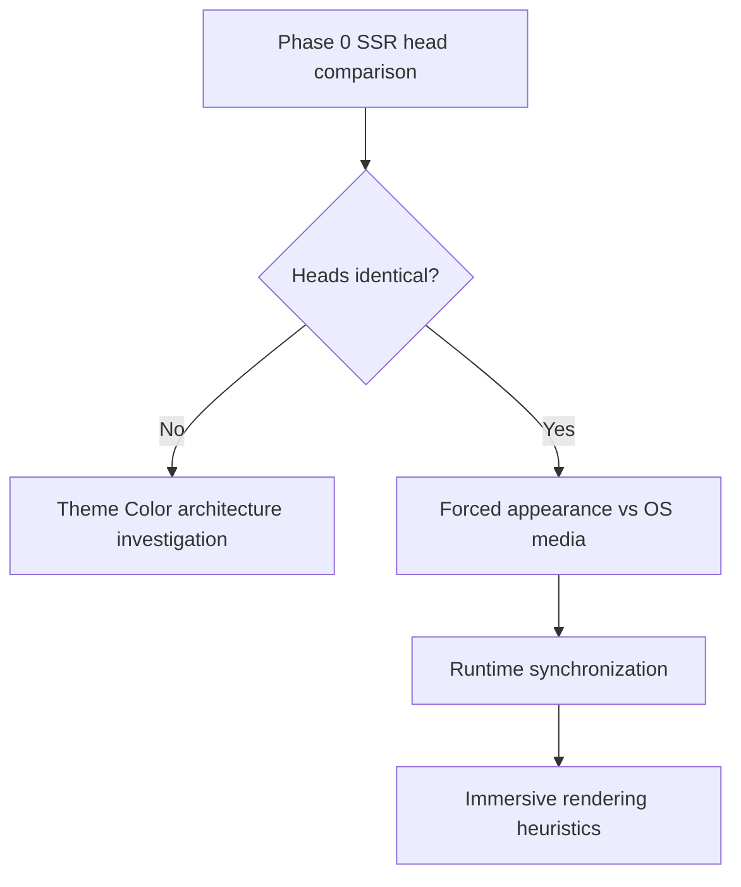

# Immersive Rendering Audit

**Status:** Method and worksheets ready — device / SSR results Pending  
**Date:** 2026-07-18 (revised: States A/B/C branching)  
**Success criterion:** Classify each affected route into State A/B/C, complete Phase 0, follow the Class 1 branch, then select exactly one [decision matrix](#decision-matrix-exit) row.

---

## Problem statement

Device screenshots show **three distinct browser chrome states**, not a single working/broken pair:

| State | Route example | Top | Bottom | App theme | Class |
|-------|---------------|-----|--------|-----------|-------|
| **A** | Home (reference) | Dark / opaque status | Dark immersive | Dark | Class 2 — color OK; immersive heuristics |
| **B** | Blog | Light | Light | Dark | Class 1 — browser appearance mismatch |
| **C** | Landing | Dark | Light | Dark | Class 3 — mixed / lifecycle |

- **Reference** = State A (Home)
- **Variant B** = Blog
- **Variant C** = Landing

**Architectural premise:** “Theme Color is already correct” is **not** a global claim. It is **only demonstrated by State A**. States B and C keep Class 1 open until Phase 0 and timing checks falsify metadata / first-paint mismatch.

Opening the menu may still fix some pages (Viewport State Transition) — that clue belongs to Class 2/3 **after** Class 1 is branched.



---

## Three-system separation

| System | Owns | Document |
|--------|------|----------|
| **Browser Chrome Theme Synchronization** | Metadata contracts (`theme-color`, manifest, Apple status bar) | [browser-chrome-theme-sync.md](./browser-chrome-theme-sync.md) |
| **Immersive Chrome Audit** | Capability limits; unsupported Dynamic Browser Chrome | [immersive-chrome-audit.md](./immersive-chrome-audit.md) |
| **Immersive Rendering Audit** (this) | Route States A/B/C; Phase 0 branching; timing vs immersive heuristics | This document |

If Phase 0 finds route-divergent theme metadata, pivot back to Theme Color architecture — contracts may be violated. Do not chase compositor explanations until that branch is resolved.

**Top status bar:** An opaque top status bar with a correct dark bottom chin (State A) is often browser-chosen and may remain Class 2. A **light** top+bottom while the app is dark (State B) is Class 1 first.

---

## Problem classes

| Class | Name | Meaning | Primary states |
|-------|------|---------|----------------|
| **1** | **Browser appearance mismatch** | Top/bottom chrome disagree with app Appearance; cause unknown until Phase 0 / timing | B (primary), C (may share) |
| **2** | Correct color, not immersive | Chrome color matches Forced dark; top opaque and/or immersive only after VST | A |
| **3** | Mixed top/bottom | Top and bottom disagree with each other after (or before) sync | C |

“Mismatch” is neutral: the browser may be honoring OS media, showing stale toolbar state, or the app may not have synchronized yet.

---

## Non-goals

- Speculative CSS / layout fixes before one decision-matrix row is selected
- Forcing translucent top status bar via unsupported APIs
- Re-litigating content-sampled Dynamic Browser Chrome ([immersive-chrome-audit.md](./immersive-chrome-audit.md) STOP)
- Claiming Theme Color is globally correct without Phase 0 + State A evidence

---

## Codebase context

Marketing routes share one [`generateViewport`](../src/app/[locale]/layout.tsx) on the locale layout. SSR emits **media-qualified** light/dark `theme-color` pairs from the published theme and **does not encode Forced appearance**. If the app is Forced dark while the OS is light, cold-load chrome can follow OS media until `theme-init.js` / `ThemeEngineProvider` collapses metas.

Shared shell (route-invariant):

```
site-shell → header → main.site-main → MarketingPageTransition → children
```

| Factor | Where |
|--------|--------|
| Locale Theme Color emission | [`src/app/[locale]/layout.tsx`](../src/app/[locale]/layout.tsx) `generateViewport` / `generateMetadata` |
| Pre-React meta sync | [`public/theme-init.js`](../public/theme-init.js) |
| Runtime meta sync | [`syncThemeColorMeta`](../src/features/theme/engine/appearance.ts) via `ThemeEngineProvider` |
| Header overlay / glass | [`header-builder.css`](../src/features/navigation/components/header/header-builder.css), [`header-overlay.ts`](../src/features/builder/header-overlay.ts) |
| Body scroll lock + fullscreen overlay | Mobile menu; [`site-preloader.css`](../src/styles/site-preloader.css) |

---

## Ranked hypotheses

| Rank | Hypothesis | Rejected when |
|------|------------|---------------|
| 1 | **Route metadata consistency** | Theme-related SSR tags identical across Home / Blog / Landing |
| 2 | **Forced appearance vs OS media first paint** | Cold-load metas already match Forced dark before any JS (or OS already dark) |
| 3 | Scroll-lock / viewport state transition | VST without lock still immerses **or** lock alone does not |
| 4 | Initial viewport geometry | Geometry + composition identical across states that differ |
| 5 | Bottom-edge composition | Bottom 120px identical after geometry matched |
| 6 | Header compositing | Overlay/transition flags identical; toggling no chin change |
| 7 | Theme Color implementation defect | Only if Phase 0 fails **or** sync contracts fail after heads match |

---

## Investigation method

### Phase 0 — SSR `<head>` comparison (before React)

Compare **server HTML** (curl / view-source), not DevTools after hydration, for Home, Blog, and Landing:

- All `<meta name="theme-color">` (content + media)
- `color-scheme` / viewport (`viewport-fit`, etc.)
- Apple web app / status bar tags

**Expectation (to be verified):** Marketing routes are expected to emit identical Theme Color, viewport, color-scheme, and Apple metadata because they share the same locale layout ownership. Phase 0 exists to verify this assumption before treating timing or browser heuristics as the primary explanation.

| Phase 0 result | Next |
|----------------|------|
| Heads **differ** | Theme Color architecture investigation ([browser-chrome-theme-sync.md](./browser-chrome-theme-sync.md)) |
| Heads **identical** | Continue Class 1 as Forced vs OS → runtime sync → then Class 2/3 immersive heuristics |

### Phase 1 — Lock routes + Environment

Record Environment (device, Chrome, Android, gesture vs 3-button, address bar position, PWA, incognito, pull-to-refresh, flags). Map routes to States A/B/C.

Controls: `/preview/immersive-chrome/solid-red`, `/preview/immersive-chrome/hero-with-site-header`.

### Phase 2 — Idle first paint + appearance timeline

Before interaction, capture DOM/computed, viewport geometry, and first-viewport band map (as needed for Class 2/3).

**Appearance timeline (required for Class 1):**

| Check | Home | Blog | Landing |
|-------|------|------|---------|
| Appearance before JS (OS media) | Pending | Pending | Pending |
| Appearance after `theme-init.js` | Pending | Pending | Pending |
| Appearance after hydration | Pending | Pending | Pending |

Aligns with: SSR → `theme-init.js` → `ThemeEngineProvider` → user interaction.

### Phase 2b — Cold-load wait

```
Cold load → Wait 10 seconds → No interaction
```

If immersive / correct chrome appears with no interaction → timing / deferred compositor. If still mismatched → Phase 3.

### Phase 3 — Viewport State Transition A/B

On Variant B / C (and Reference for comparison):

1. Open hamburger → capture top/bottom. Close → stays or reverts?
2. `document.body.style.overflow = 'hidden'` only
3. Fullscreen `position:fixed; inset:0` without overflow lock
4. Optional: dialog, orientation, `visualViewport` resize

### Phase 4 — Apply falsification table

Mark each hypothesis Confirmed / Rejected / Inconclusive. Class 2/3 layout hypotheses only after Phase 0 allows the immersive branch.

### Phase 5 — Decision matrix exit

Select exactly one row below. No speculative ship until then.

### Phase 6 — Fixture gaps

Document later if isolation needs marketing shell + scroll-lock / fixed CTA / overlay hero. Do not implement unless comparison is blocked.

---

## Decision matrix (exit)

| Result | Next action |
|--------|-------------|
| SSR head differs by route | Theme Color architecture investigation |
| Heads identical; Forced vs OS first-paint mismatch | Timing/sync task (`theme-init` / meta collapse) |
| Color matches Forced; immersive only after VST | Compositor / geometry follow-up |
| Mixed top/bottom after sync | Class 3 lifecycle task |
| No reproducible difference | Browser heuristic variability |

---

## Environment block

| Field | Value |
|-------|-------|
| Date | Pending |
| Device | Pending |
| Android version | Pending |
| Chrome version | Pending |
| Navigation | Gesture / Three-button — Pending |
| Address bar position | Top / Bottom — Pending |
| PWA installed | Yes / No — Pending |
| Profile | Incognito / Normal — Pending |
| Pull-to-refresh | On / Off — Pending |
| Flags changed? | No / list — Pending |
| OS `prefers-color-scheme` | light / dark — Pending |
| App Appearance mode | light / dark / system — Pending |

---

## Worksheet — Route identity

| Role | URL / path | Observed state |
|------|------------|----------------|
| Reference | Home — Pending path | A |
| Variant B | Blog — Pending path | B |
| Variant C | Landing — Pending path | C |
| Control solid | `/preview/immersive-chrome/solid-red` | — |
| Control header | `/preview/immersive-chrome/hero-with-site-header` | — |

---

## Worksheet — Phase 0 SSR head

| Tag / attribute | Home | Blog | Landing | Identical? |
|-----------------|------|------|---------|------------|
| `theme-color` light media | Pending | Pending | Pending | Pending |
| `theme-color` dark media | Pending | Pending | Pending | Pending |
| Other `theme-color` | Pending | Pending | Pending | Pending |
| `color-scheme` | Pending | Pending | Pending | Pending |
| viewport / `viewport-fit` | Pending | Pending | Pending | Pending |
| Apple status bar / web app | Pending | Pending | Pending | Pending |

**Phase 0 conclusion:** Pending (identical / differs → branch)

---

## Worksheet — Route matrix

| Route | State | SSR head OK? | Chin/top cold | After 10s | After menu | After theme toggle | After reload |
|-------|-------|--------------|---------------|-----------|------------|--------------------|--------------|
| Home | A | Pending | Pending | Pending | Pending | Pending | Pending |
| Blog | B | Pending | Pending | Pending | Pending | Pending | Pending |
| Landing | C | Pending | Pending | Pending | Pending | Pending | Pending |

---

## Worksheet — Appearance timeline

| Check | Home | Blog | Landing |
|-------|------|------|---------|
| Appearance before JS (OS media) | Pending | Pending | Pending |
| Appearance after `theme-init.js` | Pending | Pending | Pending |
| Appearance after hydration | Pending | Pending | Pending |

---

## Worksheet — Viewport State Transition (Variants B/C)

| Step | Action | Blog top/bottom | Landing top/bottom | Notes |
|------|--------|-----------------|--------------------|-------|
| 1a | Open hamburger | Pending | Pending | |
| 1b | Close menu | Pending | Pending | Stays / reverts |
| 2 | `overflow: hidden` only | Pending | Pending | |
| 3 | Fixed fullscreen paint | Pending | Pending | |
| 4 | Optional other VST | Pending | Pending | |

---

## Findings (fill after evidence)

### Confirmed

_Pending._

### Rejected

_Pending._

### Unknowns

_Pending._

### Selected decision matrix row

_Pending — exactly one row from [Decision matrix](#decision-matrix-exit)._

---

## Related documents

- [browser-chrome-theme-sync.md](./browser-chrome-theme-sync.md) — Theme Color contracts; reopen if Phase 0 fails or sync contracts break
- [immersive-chrome-audit.md](./immersive-chrome-audit.md) — Unsupported immersive APIs / STOP on content-sampled chrome
