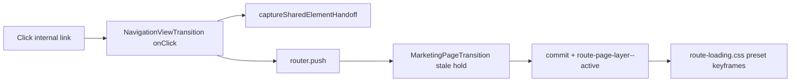

# Page Transitions (Marketing Routes)

This project implements smooth page-to-page navigation for the *marketing* app (Next.js App Router under `src/app/[locale]/...`) using:

1. A CSS route-layer transition (fade/slide/zoom/scale/instant), driven by `html[data-page-transition]`.
2. Optional shared-element handoff markup (morphing via View Transitions API is prepared but not active — route commits stay outside `document.startViewTransition` to avoid React DOM races).

It’s designed to avoid awkward blank screens by keeping outgoing content visible until the incoming route has real (non-skeleton) content.

## Admin configuration (Theme Studio)

Edit presets under **Theme Studio → Motion → Page transitions**:

- Enable / disable
- Preset: `fade` | `slide` | `zoom` | `scale` | `none`
- Duration (120–2000ms)
- Shared elements toggle (reserved for future morphing)

Values persist to `siteSettings.pageTransitions` via `/api/save-settings` when you Save or Publish in Theme Studio.

## User-visible behaviors

### Fade / Crossfade
- Outgoing route layer fades out (`.route-page-layer--stale`).
- Incoming route layer fades in (`.route-page-layer--active`).

Preset: `preset: "fade"`

### Slide
- Outgoing content slides out while fading.
- Incoming content slides in while fading.

Preset: `preset: "slide"`

### Zoom
- Outgoing content zooms out while fading.
- Incoming content zooms in while fading.

Preset: `preset: "zoom"`

### Scale
- Outgoing content scales down slightly while fading.
- Incoming content scales up from the slightly smaller size.

Preset: `preset: "scale"`

### Instant (no animation)
- Navigation still proceeds client-side, but transition effects are disabled.

Preset: `preset: "none"` (or `enabled: false`)

### Shared-element handoff (prepared)
- When navigating via a link that contains a shared-element root, the system captures which element should “morph”.
- Destination markup can set deterministic `viewTransitionName` values.
- Full browser View Transition morphing is **not** active while commits stay outside `startViewTransition`.

Enabled via:
- `sharedElementsEnabled: true`
- plus correct `data-shared-element-*` markup (see “Shared elements” below).

## Where it’s implemented

### 1) Navigation click interception + shared-element handoff
- Link click handler that:
  - captures shared-element context (`sessionStorage`) before navigation
  - performs `router.push()` with a safe helper
- [`src/components/layout/navigation-view-transition.tsx`](../src/components/layout/navigation-view-transition.tsx)

Shared element capture logic:
- [`src/lib/navigation/shared-elements/navigation-handoff.ts`](../src/lib/navigation/shared-elements/navigation-handoff.ts)

### 2) Stabilize outgoing content until real content arrives
- A wrapper that:
  - holds outgoing content briefly (`.route-page-layer--stale`)
  - then commits incoming content with `.route-page-layer--active`
- [`src/components/motion/marketing-page-transition.tsx`](../src/components/motion/marketing-page-transition.tsx)
- Enter-clear timeout reads `data-page-transition-duration` via `readPageTransitionEnterClearMs()`.

### 3) Apply preset + duration before first paint
- Inline boot script sets HTML attributes and CSS variables on `<html>`:
  - `data-page-transition`
  - `data-page-transition-enabled`
  - `data-page-transition-duration`
  - `data-shared-elements-enabled`
  - `--page-transition-duration`
  - `--page-transition-ease`
- [`src/components/layout/page-transition-boot-script.tsx`](../src/components/layout/page-transition-boot-script.tsx)

### 4) CSS route-layer animations
Preset rules target the marketing layer classes:

- `html[data-page-transition-enabled="true"][data-page-transition="<preset>"] .route-page-layer--stale`
- `html[data-page-transition-enabled="true"][data-page-transition="<preset>"] .route-page-layer--active`

Implementation:
- [`src/styles/route-loading.css`](../src/styles/route-loading.css)

Dormant `::view-transition-*` rules remain in the same file for optional future VT use.

## Configuration shape

Page transition settings are resolved from site settings:
- `siteSettings.pageTransitions`
- [`src/features/i18n/load-locale-layout-data.ts`](../src/features/i18n/load-locale-layout-data.ts)
- [`src/features/preloader/resolve-page-transitions.ts`](../src/features/preloader/resolve-page-transitions.ts)
- Schema/defaults: [`src/features/preloader/page-transitions.schema.ts`](../src/features/preloader/page-transitions.schema.ts)

### `siteSettings.pageTransitions` fields

```ts
{
  enabled: boolean; // default true
  preset: "fade" | "slide" | "zoom" | "scale" | "none"; // default "zoom"
  durationMs: number; // clamped to [120, 2000], default 300
  sharedElementsEnabled?: boolean; // default true
}
```

Notes:
- If `enabled` is false, transitions are disabled.
- If `preset` is `"none"`, transitions are also disabled.
- Shared element morphing is additionally gated by `sharedElementsEnabled` (markup/handoff only until VT is safe).

## Shared elements (markup requirements)

Shared element morphing requires consistent identifiers across:
1. The clicked link (source card)
2. The destination page (detail view)

### Link side (source)

The click handler looks for a root like:
- `data-shared-element-root`
  - `data-shared-element-type`: one of `product | collection | blog | gallery | content`
  - `data-shared-element-id`: an ID/slug shared with the destination view

### Destination side (target elements)

Elements participate by having a deterministic `viewTransitionName`.
Helper: [`src/lib/navigation/shared-elements/names.ts`](../src/lib/navigation/shared-elements/names.ts)

## Debug checklist

1. **Theme Studio / site settings**
   - Confirm Motion → Page transitions preset and duration.
   - Inspect `<html>`: `data-page-transition-enabled`, `data-page-transition`, `data-page-transition-duration`.

2. **Layer classes during navigation**
   - Outgoing: `.route-page-layer--stale`
   - Incoming: `.route-page-layer--active`
   - CSS in [`src/styles/route-loading.css`](../src/styles/route-loading.css)

3. **Reduced motion**
   - Animations are disabled under `prefers-reduced-motion`.

## Flow (high level)


