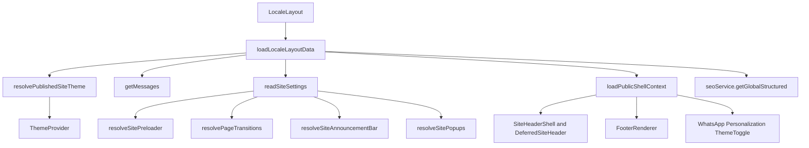

# Locale Layout Dependency Graph

Generated for the PR-4 dependency graph gate.

## Loader Graph

## Field Decomposition Table

| Field | Owner | Consumer Count | Criticality | Replacement Strategy | Removal Risk |
|-------|-------|----------------|-------------|----------------------|--------------|
| `messages` | `NextIntlClientProvider` | 1 direct, many transitive | Critical | Keep in locale layout until namespace splitting is designed separately. | High |
| `shell.headerWorkspace` | `SiteHeaderShell`, `DeferredSiteHeader` | 2 | Critical above-fold | Keep in locale layout. Later split into minimal SSR header and deferred menu enrichment. | High |
| `shell.enabledLocales` | Header locale switcher, announcement, personalization | 4 | Critical | Keep in locale layout. | High |
| `shell.direction` | document attributes | 2 | Critical | Keep in locale layout. | High |
| `shell.theme` | header, personalization, theme preset props | 4 | Critical | Keep while theme provider is global. | Medium |
| `shell.resolvedFooter` | `FooterRenderer` | 1 | Deferred | Keep for this PR; future streaming footer can move it below first render. | Medium |
| `shell.brandConfig` | footer, preloader logo resolution | 2 | Critical for preloader; deferred for footer | Keep until a shell-only settings reader exists. | Medium |
| `shell.company` | `FooterRenderer` | 1 | Deferred | Keep for this PR; future footer split can own it. | Low |
| `shell.personalizationSettings` | `PersonalizationPanelLazy` | 1 | Lazy | Keep props for now; future deferred host can fetch on demand. | Low |
| `shell.whatsapp*` | `DeferredWhatsAppFab` | 4 | Lazy | Keep props for now; future deferred host can fetch on demand. | Low |
| `siteSettings` | Internal derivations only | 4 derived consumers | Mixed | Keep internal; future `readSiteShellSettings()` should limit keys to preloader, transitions, announcement, popups. | Medium |
| `resolvedTheme` | `ThemeProvider` | 1 | Critical above-fold | Keep in locale layout. | High |
| `preloaderSettings` | `PreloaderBootScript`, `DeferredSitePreloaderHost` | 2 | Critical when enabled | Keep in locale layout. | High |
| `pageTransitionSettings` | boot script and attributes | 2 | Critical for transition classes | Keep in locale layout. | Medium |
| `announcementBarSettings` | `GlobalAnnouncementBar` | 1 | Critical when enabled | Keep in locale layout. | Medium |
| `popupSettings` | `DeferredGlobalPopupHost` | 1 | Lazy | Keep props for now; future deferred host can fetch on demand. | Low |
| `htmlLang` | document scripts/attributes | 2 | Critical | Keep in locale layout. | High |
| `comparison` | `CatalogComparisonShell` | 1 direct | On-demand | Move out of locale layout and load only in products, collections, and compare route layouts. | Low |
| `globalStructured` | `GlobalStructuredDataSync` | 1 | Deferred SEO | Keep in locale layout for this PR to avoid SEO behavior changes. | Medium |

## Search Semantics Contract

- Header search/autocomplete depends on `shell.headerWorkspace`, `shell.enabledLocales`, `shell.theme`, and the global `messages` object.
- Catalog listing labels do not come from `loadLocaleLayoutData()` directly; catalog routes load listing labels through catalog loaders.
- The comparison provider depends on `comparison.comparableTypes` and `comparison.labels`. Moving this field is safe when the provider is reintroduced in products, collections, and compare layouts.
- Account session state is not required for public header search semantics and can be scoped to account routes.
- Product quick-view events only need a provider on catalog/product surfaces that can emit `az:product-quick-view`.

## PR-4 Safe Moves

1. Remove `comparison` from `loadLocaleLayoutData()` and load it in route layouts for products, collections, and compare.
2. Move `ProductQuickViewProvider` from global locale layout to products and collections layouts.
3. Move `AccountSessionProvider` from global locale layout to account layout.

## Deferred Later

- Namespace-split `messages`.
- Add `readSiteShellSettings()`.
- Stream or route-scope footer data.
- Let deferred WhatsApp, popup, and personalization hosts fetch their own settings.
