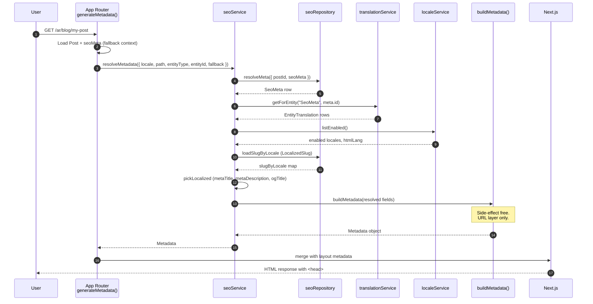

# SEO System — Architecture Reference

> **Auto-fill is an outcome, not the product.**  
> The product is an extensible **SEO Platform** where content is understood, metadata is generated and governed through composable **capabilities**, automation orchestrates the lifecycle via **declarative pipelines**, and every `<head>` value is **explainable**.

> **Audience:** New developers, code reviewers, and AI agents working on public metadata, sitemaps, redirects, or search integrations.  
> **Scope:** Frozen **Core Platform** (read path), new **SEO Platform** (write path under `src/features/seo/platform/`), governance rules, enterprise-scale read-path epics, and admin IA.

---

## SEO Platform — Layer Model

Official documentation uses **layers first**, then engines/services within each layer.

| Layer | Responsibility | Components |
|-------|----------------|------------|
| **Core Platform** (frozen) | Store, resolve, render public metadata | `SeoMeta`, `EntityTranslation`, `seoService`, `buildMetadata()`, triggers, integrations |
| **Content Layer** | Understand page content (not SEO) | Content Engine, analyzers, immutable `ContentSnapshot` |
| **Intelligence Layer** | Generate SEO candidates | Template Engine, Generation capability, AI providers |
| **Governance Layer** | Rules, validation, knowledge, schemas | Rule Engine, Validation Engine, Knowledge store, Schema registry |
| **Automation Layer** | Workflow orchestration | Event bus, declarative pipeline, approval, persist |
| **Observability Layer** (cross-cutting) | Provenance, audit, inspector | Hooks on every capability—not a pipeline stage |

**Services (not engines):** `RecommendationService` (view over validation + rules + signals), `SimulationService` (projected scores—independent of recommendations).

**External consumers** (admin, CMS, API, cron) call **only** the `SeoPlatform` facade:

- `content.analyze(ctx)` → `ContentSnapshot`
- `intelligence.generate(ctx, snapshot)` → `SeoSuggestion`
- `governance.validate(ctx, input)` / `evaluateRules(ctx, snapshot)`
- `recommendations.build(ctx, input)`
- `simulation.project(ctx, input)`
- `automation.run(ctx, pipelineId?)`

**Plugin SDK** (`registerAnalyzer`, `registerRule`, `registerValidator`, `registerTemplate`, `registerProvider`, `registerStrategy`, `registerSchema`) extends layers without forking core code.

**Implementation:** `src/features/seo/platform/` — see module layout in the implementation roadmap.

---

## Knowledge vs AI separation

AI providers **never read raw block trees**. Generation inputs are always structured:

```
Content → ContentSnapshot (immutable)
Knowledge → Rules → Templates
                    ↓
              AI Provider (reads: Snapshot + Rules + Templates + Knowledge)
                    ↓
              SeoSuggestion (with ProvenanceChain)
```

---

## Declarative automation pipeline

Pipelines are stored in JsonStore (`seo-pipelines`) or use built-in defaults:

```yaml
id: standard-publish
trigger: page_save
steps:
  - capability: analysis
  - capability: generation
  - capability: validation
    on_critical: halt
  - service: recommendations
  - gate: approval
    required_when: { source: publish }
  - capability: publishing
  - event: submit
```

**Auto-fill** = running `standard-bulk` with `source: bulk` — an outcome, not a standalone feature.

Profiles (Conservative / Balanced / Aggressive / AI-assisted) select pipeline IDs via `SeoStrategy` registry.

---

## High-Level Vision

The SEO system is a **centralized, entity-driven architecture** that decouples SEO metadata from business entities while supporting localization, automation, search-engine integrations, structured data, redirects, and quality monitoring.

It provides a **single SEO abstraction** consumed by all public pages — whether they originate from CMS pages, blog posts, catalog products, packages, static marketing routes, or generic content types. Pages do not own SEO columns; they **reference** a shared `SeoMeta` record through a stable `(entityType, entityId)` or `pageKey` link.

**Core idea:** one resolution pipeline, many content sources.

---

## Design Principles

| Principle | Meaning in this codebase |
|---|---|
| **Entity-driven** | SEO lives in `SeoMeta`, linked to content — not embedded in page tables |
| **Localization independent** | Locale-neutral fields on `SeoMeta`; localized text in `EntityTranslation` |
| **Framework-aligned, not framework-coupled** | `seoService` returns plain data; `buildMetadata()` is the only Next.js adapter |
| **Automation first** | Content/SEO changes emit events → submission jobs → search providers |
| **Provider abstraction** | Google, Bing, IndexNow share one job queue and runner |
| **Event-driven** | `seoTriggerService` reacts to publish, slug, metadata, redirect events |
| **Immutable resolution** | `resolveMetadata()` is a read pipeline; writes go through admin actions only |
| **Centralized source of truth** | All public `<head>` metadata flows through `seoService` → `buildMetadata()` |

---

## Architectural Constraints

These rules are **non-negotiable** for public SEO behavior. Violating them creates inconsistent `<head>` output, stale metadata, or request-path latency.

| # | Constraint |
|---|---|
| 1 | **Public routes must never query `SeoMeta` directly.** Use `seoService.resolveMetadata()` or `seoRepository.resolveMeta()` only from within the SEO service layer — not from page components or ad-hoc route logic. |
| 2 | **All page metadata must flow through `seoService.resolveMetadata()`.** Routes implement `generateMetadata()` by calling the service with entity context and content fallbacks — not by calling `buildMetadata()` with hand-built strings. |
| 3 | **`buildMetadata()` must remain side-effect free.** No DB access, no network calls, no cache writes. It converts a resolved SEO model into Next.js `Metadata`. |
| 4 | **Integrations must never run synchronously in the request path.** Search-engine submission (Google, Bing, IndexNow) is async via `SeoSubmissionJob` + `seoSubmissionRunner`. |
| 5 | **`SeoMeta` must not contain localized fields.** Titles, descriptions, and OG text live in `EntityTranslation`. Adding locale columns to `SeoMeta` breaks the platform i18n model. |
| 6 | **Canonical and hreflang URLs must be composed by the URL resolution layer.** Use `buildCanonicalUrl()` and `buildHreflangAlternates()` — do not concatenate `SITE_URL + path` manually in routes. |
| 7 | **Localized slugs must come from `LocalizedSlug` or explicit `slugByLocale`.** Do not assume one slug applies to all locales when building alternates. |
| 8 | **SEO writes must sync translations through `syncEntityTranslationsFromForm()`.** Do not insert `EntityTranslation` rows for `SeoMeta` outside the established translation helpers. |
| 9 | **Redirect changes must invalidate `CACHE_TAGS.redirects` and refresh the middleware manifest.** Skipping this leaves stale 301/302 behavior for up to 60 seconds (or longer via manifest). |
| 10 | **Block-level SEO is supplemental.** Primary `<head>` metadata comes from `SeoMeta`. Builder block SEO must not replace page-level resolution. |

---

## Major Architectural Decisions (ADR)

### ADR-1: Entity-driven `SeoMeta` instead of columns on content tables

**Decision:** SEO metadata is stored in a dedicated `SeoMeta` table, linked to content via `pageKey`, `cmsPageId`, `postId`, or `(entityType, entityId)`.

**Rationale:**

- One resolution pipeline for all content types
- CMS pages, posts, and catalog items share the same admin panel and scoring logic
- Adding SEO to a new entity type requires a link, not a schema migration on every content table

**Alternatives rejected:** `titleEn`/`descriptionEn` columns on `CmsPage`, `Post`, etc. — leads to duplicated logic and inconsistent admin UX.

---

### ADR-2: `EntityTranslation` for localized SEO text

**Decision:** `SeoMeta` holds only locale-independent fields. Localized values (`metaTitle`, `metaDescription`, `ogTitle`, `ogDescription`) use the generic `EntityTranslation` infrastructure.

**Rationale:**

- Avoid schema growth when adding locales (no `titleFr`, `titleDe`, …)
- Reuse translation admin UI, sync helpers, and search indexing
- SEO follows the same i18n strategy as every other translatable entity

**Alternatives rejected:** Localized columns on `SeoMeta` — duplicates the platform translation model and breaks bulk locale tooling.

---

### ADR-3: Async search-engine submission

**Decision:** Content and SEO changes enqueue `SeoSubmissionJob` rows; a background runner submits to providers with retries and backoff.

**Rationale:**

- Avoid request latency on publish/save actions
- Failure isolation — a Bing API outage must not block CMS saves
- Retry support with exponential backoff (1m → 5m → 30m → 2h → 6h, max 5 attempts)

**Alternatives rejected:** Synchronous `fetch()` to Google/Bing/IndexNow inside server actions — blocks admin UX and couples availability to third parties.

---

### ADR-4: URL resolution as a separate layer

**Decision:** Canonical and hreflang URLs are composed by `buildCanonicalUrl()` and `buildHreflangAlternates()` in `src/i18n/seo-helpers.ts`, not stored as the primary source of truth on every record.

**Rationale:**

- `SeoMeta.canonicalUrl` is an **override**, not the default mechanism
- Per-locale slugs (`LocalizedSlug`) require computed alternates
- `NEXT_PUBLIC_SITE_URL`, locale prefixes, and default paths stay consistent

---

### ADR-5: No dedicated SEO `unstable_cache` wrapper

**Decision:** Metadata freshness relies on route ISR (`revalidate = 60`), tag-based invalidation (`CACHE_TAGS`), and publish propagation — not a custom cached `resolveMeta()` layer.

**Rationale:**

- SEO data changes infrequently relative to page body content
- Translation and content tags already invalidate related routes
- A dedicated SEO cache tag can be added later without restructuring layers

**Trade-off:** Sub-minute public `<head>` updates after SEO-only edits may wait for ISR expiry unless a targeted `revalidatePath` runs for that route.

---

### ADR-6: Primary page SEO vs supplemental block SEO

**Decision:** `SeoMeta` drives global `<head>` tags. Builder blocks may carry `BlockSeoSettings` resolved by `resolveBlockSeo()` for supplemental structured data or markers — not as a replacement for page metadata.

**Rationale:**

- One authoritative record per page for title, description, canonical, hreflang
- Blocks remain composable without each block owning global head tags

---

## Anti-Patterns

### Avoid

| Anti-pattern | Why it is wrong | Do instead |
|---|---|---|
| Reading `prisma.seoMeta` directly in a route's `generateMetadata()` | Bypasses resolution priority, slug loading, and localization | `seoService.resolveMetadata()` |
| Constructing canonical URLs manually (`${siteUrl}/${locale}${path}`) | Misses localized slugs, overrides, and `x-default` | `buildCanonicalUrl()` + `buildHreflangAlternates()` |
| Writing `EntityTranslation` for SEO outside `syncEntityTranslationsFromForm()` | Inconsistent field names, missing deletes, no trigger hooks | `upsertSeoMetaAction` → `syncSeoMetaTranslations()` |
| Calling provider APIs from publish/save actions | Blocks admin, no retries, couples UX to third parties | `seoTriggerService.handle()` → job queue |
| Adding localized columns to `SeoMeta` | Breaks i18n architecture | Register fields in `ENTITY_REGISTRY` under `SeoMeta` |
| Putting SEO logic inside `buildMetadata()` | Mixes pure formatting with data fetching | Fetch in `seoService`; pass resolved values to `buildMetadata()` |
| Using block SEO as the only metadata source for a page | No central record, no audit/scoring, no sitemap `noindex` integration | Create/link `SeoMeta` for the page entity |
| Skipping `revalidateTag(CACHE_TAGS.redirects)` on redirect CRUD | Stale redirects in middleware/API cache | Follow `upsertRedirectAction` / `deleteRedirectAction` pattern |
| Synchronous crawl or submission in `generateMetadata()` | Adds latency to every page request | Quality audit and integrations run in admin/cron paths only |

---

## Core Design: Entity-Driven SEO

**SEO is NOT stored inside pages.**

```
CmsPage (custom /pages/[slug]) ──references──▶ SeoMeta (via cmsPageId)
CmsPage (wired marketing slug)  ──references──▶ SeoMeta (via pageKey = slug)
Post                            ──references──▶ SeoMeta (via postId)
Product                         ──references──▶ SeoMeta (via entityType + entityId)
Home                            ──references──▶ SeoMeta (via pageKey = "home")
```

**Wired marketing pages** (`home`, `about`, `contact`, …) use a single `SeoMeta` row keyed by `pageKey`. Both `/admin/seo/metadata?tab=pages` and the page editor SEO tab read and write that same row. The exception is `why-choose-us`, which uses `cmsPageId` only.

### Canonical read model: `PageSeoContext`

All consumers must resolve SEO through **`resolvePageSeoContext()`** and map to their surface via thin mappers — not by assembling state in routes.

```
Persistence (SeoMeta + EntityTranslation + CmsPage)
        ↓
resolvePageSeoContext() / listPageSeoContexts()
        ↓
PageSeoContext (canonical DTO)
        ↓
Mappers (toSeoMetaFormProps, seoService.resolveMetadata, sitemap, publish)
        ↓
Consumers (admin, public <head>, jobs)
```

`PageSeoContext` fields: `identity`, `writeTarget`, `meta`, `translations`, `savedTranslations`, `contentFallbacks`, `origin`, `indexing`.

Site origin: **`resolveSiteOrigin(context)`** — single precedence for admin preview, public metadata, background jobs, and sitemap.

**Anti-pattern:** coalesce/merge logic, `savedTranslations` assembly, or origin selection inside routes or page loaders.

### Definition of done (read-model consolidation)

- [ ] No consumer outside `resolve-page-seo-context.ts` contains `if (pageKeyMeta)` / `if (cmsSeoMeta)` resolution
- [ ] Admin SEO hub and page editor both call `toSeoMetaFormProps(resolvePageSeoContext(...))`
- [ ] `generateMetadata` routes pass identity only (`pageKey`, `cmsPageId`, `postId`) — no `seoMeta` preload
- [ ] Parity tests pass for the same entity across admin and public mappers
- [ ] `scripts/check-seo-resolution-leaks.sh` passes in CI

### Legacy resolution (`seoRepository.resolveMeta`) — deprecated for public reads

Use `resolvePageSeoContext` → `resolveEffectiveSeoForLocale` instead. `resolveMeta` remains for internal repository queries only.


### Why `EntityTranslation` exists

| Field | Storage |
|---|---|
| Meta title | `EntityTranslation.metaTitle` |
| Meta description | `EntityTranslation.metaDescription` |
| OG title | `EntityTranslation.ogTitle` |
| OG description | `EntityTranslation.ogDescription` |

`SeoMeta` holds: `canonicalUrl`, `robots`, `focusKeywords`, `ogImageUrl`, `twitterCard`, `jsonLd`.

---

## Layer Responsibilities

| Layer | Location | Responsibility |
|---|---|---|
| **Repository** | `src/repositories/seo.repository.ts` | DB access, JsonStore config, job queue, crawl issues |
| **Service** | `src/features/seo/seo.service.ts` | Metadata resolution, localization, slug loading |
| **Metadata builder** | `src/lib/seo.tsx` | SEO model → Next.js `Metadata` + JSON-LD helpers |
| **URL resolution** | `src/i18n/seo-helpers.ts` | Canonical + hreflang URL construction |
| **Triggers** | `src/features/seo/triggers/` | Domain events → submission enqueue |
| **Integrations** | `src/features/seo/integrations/` | Provider config, job runner, telemetry |
| **Sitemap / Robots** | `sitemap.service.ts`, `robots.ts` | Crawl surface generation |
| **Quality / Audit** | `src/features/seo/quality/` | Canonical, redirect, schema, link analysis |
| **Scoring** | `src/features/seo/scoring/` | Editor guidance (admin only) |
| **Admin** | `src/features/seo/admin/`, `actions.ts` | Editing, bulk fill, settings |
| **Search index bridge** | `seo-index-loader.ts` | SEO snapshot for internal search |

---

## Dependency Map

```
                    ┌─────────────────────────────────────────┐
                    │              Admin UI                    │
                    │  SeoMetaForm, AdminSeoHub, audit pages   │
                    └──────────────────┬──────────────────────┘
                                       │ server actions
                                       ▼
┌──────────┐  ┌──────────┐  ┌─────────────┐     ┌──────────────────┐
│   CMS    │  │   Blog   │  │  Products   │     │  Static pages    │
│ CmsPage  │  │   Post   │  │ ContentItem │     │  pageKey registry│
└────┬─────┘  └────┬─────┘  └──────┬──────┘     └────────┬─────────┘
     │             │               │                      │
     └─────────────┴───────────────┴──────────────────────┘
                                   │ references
                                   ▼
                          ┌────────────────┐
                          │    SeoMeta     │◀──── EntityTranslation
                          └────────┬───────┘
                                   │
     App Router generateMetadata() │
                                   ▼
                          ┌────────────────┐
                          │   seoService   │
                          └────────┬───────┘
                                   ▼
                          ┌────────────────┐
                          │  buildMetadata   │
                          └────────┬───────┘
                                   ▼
                          Next.js Metadata → <head>

     Builder blocks ──▶ resolveBlockSeo() ──▶ supplemental payload

     Content events ──▶ seoTriggerService ──▶ integrations queue
```

**Dependency direction:** Routes → Service → Repository → DB. Integrations and audit are **downstream of writes**, never upstream of `generateMetadata()`.

---

## Sequence Diagram: Metadata Resolution



---

## URL Resolution Layer

| Input | Source |
|---|---|
| `NEXT_PUBLIC_SITE_URL` | Base origin |
| Locale prefix | `LocaleConfig.urlPrefix` |
| Path | Route-relative path |
| `LocalizedSlug` | Per-locale slug overrides |
| `canonicalUrl` | Optional override on `SeoMeta` |

**`buildCanonicalUrl()`** — default canonical when no override is set.  
**`buildHreflangAlternates()`** — `languages` map + `x-default` for default locale.

```
canonicalUrl override?  ──yes──▶ use override
        │ no
        ▼
buildCanonicalUrl(SITE_URL, locale, path, slugByLocale[locale])
```

---

## Rendering Pipeline

```
HTTP Request
     ▼
App Router matched segment
     ▼
generateMetadata({ params })
     ▼
seoService.resolveMetadata()
     ├── seoRepository.resolveMeta()
     ├── translationService (EntityTranslation)
     ├── localeService (enabled locales)
     ├── loadSlugByLocale() (LocalizedSlug)
     └── resolveSiteIdentityFromDb() (brand name)
     ▼
buildMetadata()  →  Next.js Metadata
     ▼
<head> (title, description, robots, canonical, hreflang, OG, Twitter)
     ▼
Page component + PageSeoJsonLd + GlobalStructuredDataSync
```

### CMS → final HTML

```
Admin saves CMS page + SEO panel
     ▼
CmsPage updated    SeoMeta upserted (cmsPageId)
                   EntityTranslation synced
     ▼
seoTriggerService (on publish) → submission jobs
     ▼
GET /en/pages/about-us
     ▼
generateMetadata() → seoService → buildMetadata()
     ▼
<head> + MarketingCmsPage (builder blocks)
```

---

## Caching and Invalidation

SEO metadata is resolved on every `generateMetadata()` call. Freshness is delegated to:

| Mechanism | Role |
|---|---|
| Route ISR (`revalidate = 60`) | Cached HTML/metadata on marketing routes |
| `force-dynamic` locale layout | Shell/global JSON-LD always fresh |
| `revalidateTag(CACHE_TAGS.redirects)` | Redirect middleware/API cache |
| `revalidateTranslations()` | Entity translation cache tags |
| Publish propagation | Shell/marketing tags on site-wide publish |

**There is no dedicated SEO `unstable_cache` wrapper today.** Sub-minute SEO-only updates may require a future `CACHE_TAGS.seoMeta(entityType, entityId)` extension.

Redirect caches: middleware 60s TTL, `/api/redirects` 60s in-process cache, middleware manifest until redirect CRUD refresh.

---

## Feature Flags

`src/features/seo/observability-flags.ts` — all default **enabled** unless env is `"false"`:

| Variable | Controls |
|---|---|
| `SEO_TELEMETRY_ENABLED` | Provider telemetry writes |
| `SEO_HEALTH_SCORE_ENABLED` | Aggregate health score |
| `SEO_ANALYTICS_INGESTION_ENABLED` | Google Search Console ingestion |
| `SEO_RICH_RESULTS_ENABLED` | Rich results monitoring |

---

## Builder Relationship

| Level | Source | Drives |
|---|---|---|
| **Primary** | `SeoMeta` | Global `<head>`: title, description, canonical, hreflang, OG |
| **Supplemental** | `BlockSeoSettings` → `resolveBlockSeo()` | Block-level JSON-LD, noindex markers, optional OG overrides |

Blocks participate in SEO **without modifying the page's primary `SeoMeta` record**.

---

## Extensibility

Adding SEO to a new content type (Course, Event, Vendor, Category) requires **no core architecture change**:

1. Link `SeoMeta` via `(entityType, entityId)`
2. Call `seoService.resolveMetadata()` in `generateMetadata()`
3. Optionally emit `seoTriggerService` events on publish/slug change
4. Optionally add URLs to `sitemap.service.ts`

Resolution, localization, URL building, scoring, audit, and integrations remain unchanged.

### Future extensions (no core refactor)

| Extension | Integration point |
|---|---|
| AI-generated titles/descriptions | Admin action → `EntityTranslation` via sync helpers |
| Keyword extraction | Post-save → `focusKeywords` |
| LLM JSON-LD | Write `SeoMeta.jsonLd` |
| OG image generation | Write `ogImageUrl` |
| New search providers | `SEO_INTEGRATION_PROVIDERS` + runner |
| Dedicated SEO cache tag | `unstable_cache` on `resolveMeta` with entity-scoped tag |

---

## Automation and Integrations (summary)

Content lifecycle events → `seoTriggerService` → `SeoSubmissionJob` → `seoSubmissionRunner` → IndexNow / Bing / Google (sitemap).

Providers share one queue with retries, backoff, distributed lock, and optional telemetry.

---

## Data Model (concise)

### `SeoMeta`

Linked by `pageKey`, `cmsPageId`, `postId`, or `(entityType, entityId)`.

Locale-neutral: `canonicalUrl`, `robots`, `focusKeywords`, `ogImageUrl`, `twitterCard`, `jsonLd`.

### JsonStore

| Namespace | Content |
|---|---|
| `seo-global` | Robots.txt extras, host |
| `seo-structured` | Global organization + website JSON-LD |
| `seo-integrations` | Provider credentials (sealed) |

### Operational tables

`SeoRedirect`, `SeoSubmissionJob`, `SeoCrawlIssue`, `SeoRichResultIssue`, `SeoHealthSnapshot`, `SeoSearchMetric`, `Custom404`.

---

## Key Files

| Concern | Path |
|---|---|
| Service | `src/features/seo/seo.service.ts` |
| Next.js adapter | `src/lib/seo.tsx` |
| Repository | `src/repositories/seo.repository.ts` |
| URL layer | `src/i18n/seo-helpers.ts` |
| Constants / static registry | `src/features/seo/constants.ts` |
| Triggers | `src/features/seo/triggers/` |
| Integrations | `src/features/seo/integrations/` |
| Cache tags | `src/services/cache.ts` |
| Feature flags | `src/features/seo/observability-flags.ts` |
| Block SEO | `src/features/builder/seo/block-seo.ts` |
| Admin hub | `/admin/seo` |
| Prisma | `prisma/schema/*/platform.prisma` |

---

## Platform Maturity: Management vs Intelligence vs Engine

The codebase today is a mature **SEO Management Platform** — not yet an **SEO Engine**. That distinction is intentional and correct for current scale.

| Capability | Management Platform (today) | Intelligence Platform (proposed) | SEO Engine (full vision) |
|---|---|---|---|
| Store meta title, description, OG | ✅ | ✅ | ✅ |
| Canonical, robots, hreflang | ✅ | ✅ | ✅ |
| JSON-LD, redirects, sitemap | ✅ | ✅ | ✅ |
| Search submission + quality audit | ✅ | ✅ | ✅ |
| **Understand page content** (blocks, headings, links) | ❌ | ✅ | ✅ |
| **Auto-generate** metadata from content | Partial (bulk fill from title/excerpt) | ✅ | ✅ |
| **Rule / strategy engine** (configurable, not hardcoded) | ❌ | ✅ | ✅ |
| **Recommendations** with fix / auto-fix / ignore | Score only | ✅ | ✅ |
| **Explainability** (why each `<head>` value exists) | ❌ | ✅ | ✅ |
| **Extensible analyzer pipeline** | ❌ | Partial | ✅ |
| **Full lifecycle workflow** (analyze → approve → monitor) | CRUD + audit | ✅ | ✅ |

**Management** = humans (or simple bulk fill) write `SeoMeta`; the system resolves and distributes it reliably.

**Intelligence** = the system analyzes content, proposes or generates SEO, validates against rules, scores, and recommends — with the developer controlling every stage.

**Engine** = all intelligence stages run through a composable, pluggable pipeline; any stage can be replaced without touching the foundation.

The foundation (`SeoMeta`, `seoService`, `buildMetadata()`, triggers, integrations) **does not change**. Intelligence sits **above** content, **below** admin approval, and **writes into** `SeoMeta` — the same store the public site already reads.

---

## SEO Intelligence Layer (Vision)

> **Status:** Proposed evolution — additive layer on top of the frozen foundation. Not required for current operations.

### Target architecture

```
Content (CMS page, post, product, block tree)
        │
        ▼
┌───────────────────────────────────────────────────┐
│           SEO Intelligence Layer                   │
│  Analyze → Generate → Validate → Score → Recommend │
│  (extensible analyzers, rules, strategies, AI)     │
└───────────────────────┬───────────────────────────┘
                        │ writes approved output
                        ▼
                   SeoMeta + EntityTranslation
                        │
                        ▼
              Metadata Resolution (seoService)
                        │
                        ▼
                   Public Site (<head>)
```

Intelligence is a **write-path** concern. Resolution, snapshots, CDN, and `<head>` rendering remain on the **read path** unchanged.

### Full SEO lifecycle (target)

```
Analyze → Generate → Validate → Preview → Approve → Persist → Publish → Submit → Monitor → Improve
```

Today the system covers **Persist → Publish → Submit → Monitor** well. The gap is everything upstream of persist.

---

### 1. Content Analysis Engine ⭐⭐⭐⭐⭐

Foundation for all intelligence operations. Analyzes the **entire page**, not just title and excerpt.

```
Page → Block Tree → Extract Text → Normalize
  → Heading Structure → Images → Links → Keywords → Semantic Topics
```

**Output model (proposed):**

```typescript
type ContentAnalysis = {
  title: string;
  headings: Array<{ level: number; text: string }>;
  paragraphs: string[];
  keywords: string[];
  entities: string[];           // named entities / topics
  readingTime: number;
  language: string;
  images: Array<{ src: string; alt?: string }>;
  internalLinks: string[];
  externalLinks: string[];
  faqSections: Array<{ question: string; answer: string }>;
  productData?: Record<string, unknown>;
  signals: ContentSignals;      // see §8
};
```

**Maps to today:** Builder block tree (`BlockRenderer`), CMS revisions, `content-public.service` — no equivalent analyzer exists yet. Search FTS indexing extracts text but not structured SEO signals.

---

### 2. Metadata Auto-Generation ⭐⭐⭐⭐⭐

Replace naive bulk fill (`title = page title, description = excerpt`) with content-driven generation:

```
Analyze Content → Generate Candidates → Validate → Score → Save (or queue for approval)
```

Generated fields: meta title (30–60 chars), description (120–160), focus keywords, OG title, inferred JSON-LD.

**Maps to today:** `seo-bulk.service.ts` — extend or replace with pipeline-backed generation; output still lands in `EntityTranslation` + `SeoMeta` via existing sync helpers.

---

### 3. Rule Engine (`SeoRuleEngine`) ⭐⭐⭐⭐⭐

Configurable rules instead of hardcoded checks scattered in scoring and audit:

```
IF contentType == Product
  THEN require Product schema, price, availability, OG image, canonical

IF faq block exists
  THEN recommend FAQ JSON-LD
```

Rules are data (JsonStore or DB), evaluated by the pipeline — not `if` statements in admin forms.

**Maps to today:** Partial overlap with `seo-scoring.service.ts` (hardcoded weights) and `seo-quality.service.ts` (post-hoc analyzers). Rule engine unifies both for write-time and read-time checks.

---

### 4. Recommendation Engine ⭐⭐⭐⭐⭐

Beyond a numeric score — actionable items with user choice:

| Finding | Actions |
|---|---|
| Missing H1, short description, no internal links | **Fix** (manual) · **Auto-fix** · **Ignore** |
| Image alt missing, weak title, no FAQ schema | Same |

Recommendations consume `ContentAnalysis` + current `SeoMeta` + rule engine output.

**Maps to today:** `SeoAnalysisPanel` shows score checks only — no fix/auto-fix/ignore workflow.

---

### 5. Auto-Fill Profiles ⭐⭐⭐⭐

Profiles replace a single bulk-fill mode:

| Profile | Behavior |
|---|---|
| **Conservative** | Fill empty fields only |
| **Balanced** | Improve weak metadata (score below threshold) |
| **Aggressive** | Rewrite all SEO fields |
| **AI-assisted** | Generate from `ContentAnalysis` via provider |

**Maps to today:** `BulkFillMode`: `empty-only` | `always` in `seo-bulk.service.ts`.

---

### 6. AI Provider Layer ⭐⭐⭐⭐

Pluggable generation backends — usable even when AI is disabled (rule-based fallback):

```
SeoGenerationProvider
  → RuleBasedProvider | OpenAI | Claude | Gemini | LocalLLM

generateTitle() | generateDescription() | generateKeywords() | generateSchema()
```

Admin and auto-fill profiles call the provider interface — never a vendor SDK directly.

---

### 7. SEO Templates ⭐⭐⭐⭐⭐

Pattern-based metadata for content types and strategies:

```
Product  → "{ProductName} | Buy Online | {Brand}"
Category → "Best {Category} in {Country}"
Blog     → "{ArticleTitle} | {SiteName}"
```

User-defined templates stored in config; pipeline resolves tokens from `ContentAnalysis`.

---

### 8. Content Signals Engine ⭐⭐⭐⭐

Structured signals extracted during analysis — inputs for rules, scoring, and recommendations:

H1 count · H2 structure · word count · paragraph length · image count · alt coverage · internal/external links · tables · lists · FAQ blocks · CTAs

```typescript
type ContentSignals = {
  h1Count: number;
  h2Count: number;
  wordCount: number;
  imageCount: number;
  imagesMissingAlt: number;
  internalLinkCount: number;
  externalLinkCount: number;
  hasFaq: boolean;
  hasCta: boolean;
  // …
};
```

---

### 9. SEO Pipeline ⭐⭐⭐⭐⭐

Replace monolithic save with independent stages:

```
Save (trigger)
  → Analyze
  → Generate
  → Validate
  → Score
  → Recommend
  → Persist (SeoMeta + translations)
  → Trigger (search submission)
```

Each stage is a pluggable step with typed input/output. Failures at validate block persist unless user overrides.

**Constraint:** `upsertSeoMetaAction` remains the persist boundary — pipeline stages produce data; one action commits it.

---

### 10. Extensible Analyzers ⭐⭐⭐⭐⭐

Plugin model (similar to builder blocks):

```typescript
registerAnalyzer(id, analyzer)

// Built-in examples:
HeadingAnalyzer | KeywordAnalyzer | ReadabilityAnalyzer | ImageAnalyzer
SchemaAnalyzer | InternalLinkAnalyzer | PerformanceAnalyzer
```

Analyzers append to `ContentAnalysis` / `ContentSignals`. Third parties register without modifying core code.

---

### 11. SEO Strategy Layer ⭐⭐⭐⭐⭐

User-facing presets that bundle rules, templates, scoring weights, and JSON-LD expectations:

| Strategy | Emphasis |
|---|---|
| Standard | General pages |
| Local Business | NAP, LocalBusiness schema |
| E-commerce | Product schema, offers |
| Blog / News | Article, dates, author |
| Knowledge Base | FAQ, HowTo, breadcrumbs |
| Landing Pages | Conversion-focused titles, minimal links |

Changing strategy reconfigures the pipeline — **no code deploy**.

Stored in JsonStore or `SeoStrategy` entity; referenced by content type or page.

---

### 12. Visual SEO Inspector ⭐⭐⭐⭐

Admin panel showing rendered `<head>` with **provenance** per field:

```
Title       → EntityTranslation.metaTitle (SeoMeta)
Canonical   → buildCanonicalUrl() — no override
OG Image    → SeoMeta.ogImageUrl
Description → Fallback: CmsPage.excerpt
```

Pairs with explainability (§13) for debugging without reading source code.

---

### 13. Explainability ⭐⭐⭐⭐⭐

Every resolved `<head>` value carries an explanation chain (dev/admin only, not public HTML):

```
Canonical
  → buildCanonicalUrl()
  → LocalizedSlug: "my-post" (ar)
  → No SeoMeta.canonicalUrl override
```

Generated at resolve time or stored on snapshot. Enables trust in auto-generated metadata.

**Maps to today:** No provenance model. Would extend `ResolvedSeoModel` / snapshot DTO with `provenance: Record<field, ExplanationChain>`.

---

### 14. Developer Control Model

Intelligence must remain **fully overrideable** at every stage:

| Stage | Developer control |
|---|---|
| Analyze | Register/skip analyzers; custom extractors for block types |
| Generate | Templates, providers, profiles; manual edit always wins |
| Validate | Add/remove rules; override with admin approval |
| Score | Adjust weights per strategy |
| Recommend | Ignore/dismiss; auto-fix opt-in per field |
| Persist | Existing `SeoMeta` + translation sync — unchanged |
| Resolve | Existing `seoService` — unchanged |

Auto-generated values are **candidates** until approved (or until profile policy auto-commits).

---

### Intelligence layer — proposed module layout

```
src/features/seo/intelligence/
  analysis/           ContentAnalysisEngine, analyzers/, signals/
  generation/         providers/, templates/, profiles/
  rules/              SeoRuleEngine, rule definitions
  recommendations/    RecommendationEngine, actions (fix/auto-fix/ignore)
  strategies/         SeoStrategy registry
  pipeline/           SeoIntelligencePipeline (orchestrator)
  explain/            ProvenanceBuilder
  types/              ContentAnalysis, SeoCandidate, Recommendation, …
```

Admin UI extensions: inspector, recommendation panel, strategy picker, pipeline preview.

---

### How Intelligence relates to existing roadmaps

The three **enterprise scale** epics (snapshot, contributors, cache tags) optimize the **read path**. Intelligence optimizes the **write path**. They are **orthogonal** and composable:

| Layer | Path | Epics |
|---|---|---|
| Intelligence | Write (analyze → persist) | New epic — see below |
| Snapshot + cache tags | Read (request → `<head>`) | Existing epics 1 & 3 |
| Contributors | Read (DTO → Metadata) | Existing epic 2 |

After Intelligence persists to `SeoMeta`, existing resolution, triggers, and submission flow unchanged.

---

### Recommended epic: SEO Intelligence Engine

Open **one intelligence epic** when product requires content-aware SEO (not for scale alone):

| Phase | Deliverable | Depends on |
|---|---|---|
| **A** | `ContentAnalysisEngine` + `ContentSignals` + heading/image/link analyzers | Block tree access |
| **B** | `SeoIntelligencePipeline` (analyze → validate → score) + `SeoRuleEngine` | Phase A |
| **C** | Templates + profiles (conservative/balanced/aggressive) + improved bulk fill | Phase B |
| **D** | Recommendation engine (fix / auto-fix / ignore) + inspector UI | Phase B |
| **E** | `SeoGenerationProvider` (rule-based + optional AI) | Phase C |
| **F** | Strategy layer + schema registry integration | Phase B |
| **G** | Explainability + full lifecycle (preview → approve) | Snapshot DTO (optional) |

Phases A–D deliver an **Intelligence Platform**. Phases E–G reach **Engine** maturity with full extensibility and explainability.

---

## Maturity Assessment

**Verdict:** The **management foundation** is mature — no redesign recommended. The system reliably stores, resolves, distributes, submits, and audits SEO metadata.

**Optional evolution:** An **SEO Intelligence Layer** (documented above) adds content understanding, generation, rules, recommendations, and explainability — transforming a management platform into an engine **without replacing** `SeoMeta`, `seoService`, or the integration pipeline.

Future work should focus on **performance and scalability** (read-path epics) or **content-aware automation** (intelligence epic) — not restructuring the entity-driven model.

**When to invest further:**

- **Read-path epics** (snapshot, contributors, cache tags) — content volume toward hundreds of thousands of pages, CDN latency SLOs
- **Intelligence epic** — product need for auto-generation, rule-driven governance, or explainable SEO at scale
- **Incremental backlog items** — pull individually when a concrete requirement appears

---

## Recommended Epics (Enterprise Scale)

If the platform needs to scale beyond current volume, open **three epics only** — in this order:

| Epic | Value | Effort | Trigger |
|---|---|---|---|
| **1. SEO Snapshot Engine** | ⭐⭐⭐⭐⭐ | High | High page count, CDN-heavy traffic, latency SLOs |
| **2. Metadata Contributors** | ⭐⭐⭐⭐⭐ | Medium | Frequent new head-tag types, growing `buildMetadata()` |
| **3. Dedicated SEO Cache Tags** | ⭐⭐⭐⭐ | Low | Sub-minute freshness before snapshots ship |

Everything in the incremental backlog below is **optional** — implement when a concrete need appears, not preemptively.

---

### Epic 1: SEO Snapshot Engine

The only truly **architectural** upgrade at scale. Separates resolution (write path) from rendering (read path).

**Today (every request or ISR regen):**

```
Request → resolveMetadata() → Repository → Translations → LocalizedSlug → Site Identity → buildMetadata()
```

**Proposed:**

```
Publish | SEO save | Translation update | Slug change
  → SEO Snapshot Builder
  → ResolvedSeoSnapshot (per entity, per locale)

Request → load snapshot → buildMetadata(snapshot) → <head>
```

**Benefits:** Fewer queries; no per-request translation re-resolution; predictable latency; strong CDN compatibility at 500k+ pages.

**Precedent:** `seo-index-loader.ts` already materializes `SearchIndexSeoSnapshot` for FTS — runtime snapshots reuse the same trigger hooks (`seoTriggerService`).

**Constraint:** `seoService.resolveMetadata()` remains the public entry point; snapshots load *behind* it with live-resolution fallback during migration.

---

### Epic 2: Metadata Contributors

Refactor `buildMetadata()` from a monolithic function into a contributor pipeline (middleware-style):

```
ResolvedSeoModel
  → CanonicalContributor
  → AlternateLanguagesContributor
  → OpenGraphContributor
  → TwitterContributor
  → RobotsContributor
  → merged Next.js Metadata
```

**Benefits:** New metadata types without editing the core builder; each contributor tested in isolation; natural pairing with Epic 1 (contributors consume snapshot DTOs, not Prisma).

---

### Epic 3: Dedicated SEO Cache Tags

Bridge improvement — high impact, low effort — can ship before or alongside Epic 1.

Add to `CACHE_TAGS` (`src/services/cache.ts`):

- `seo:${entityType}:${entityId}`
- `seo:${entityType}:${entityId}:${locale}` (optional per-locale granularity)

Invalidate from `upsertSeoMetaAction`, `SeoMeta` translation sync, and publish propagation. Optionally wrap live resolution in `unstable_cache` tagged per entity.

**Benefit:** Precise revalidation instead of broad `translations` / `marketing` tags; sub-minute `<head>` freshness without a snapshot table.

---

## Incremental Backlog (When Needed)

Not recommended as standing epics today. Many items are **subsumed by the Intelligence Layer** (§ SEO Intelligence Layer) when that epic opens. Pull individually only for isolated needs.

| Item | Value | When to adopt |
|---|---|---|
| SEO Policy / Rule Engine | ⭐⭐⭐⭐ | Part of Intelligence Phase B — or standalone if rules needed before full pipeline |
| SEO Validation Engine | ⭐⭐⭐⭐ | Part of Intelligence pipeline validate stage |
| Strongly typed events | ⭐⭐⭐⭐ | `SeoMetadataUpdatedEvent` — compile-time safety in triggers |
| Schema Registry | ⭐⭐⭐⭐ | Intelligence Phase F — JSON-LD types exceed ~5 helpers |
| SEO Manifest | ⭐⭐⭐⭐ | Sitemap, robots, audit, submission share one URL model |
| Public SEO API | ⭐⭐⭐ | Headless consumers (`GET /api/seo/resolve`) |
| AI Provider Layer | ⭐⭐⭐ | Intelligence Phase E — `SeoGenerationProvider` |
| Composable resolve pipeline | ⭐⭐⭐ | Internal refactor of `resolveMetadata()` into steps |
| DTO layer (`ResolvedSeoModel`) | ⭐⭐⭐ | Prerequisite for snapshot + explainability |
| Canonical policy layer | ⭐⭐⭐ | UTM, pagination, filters, AMP normalization |
| Observability metrics | ⭐⭐⭐ | `metadata.resolve.duration_ms`, cache hit/miss |
| Metadata testing harness | ⭐⭐⭐ | Snapshot tests for expected `<head>` output |
| Configuration registry | ⭐⭐ | `SeoConfigurationService` facade over JsonStore |

---

## Frozen Foundation

Do **not** restructure these — they are correct as designed:

| Decision | Rationale |
|---|---|
| `EntityTranslation` for localized SEO text | Platform i18n consistency; no locale columns on `SeoMeta` |
| `SeoMeta` as independent entity | One pipeline, many content sources |
| `seoService.resolveMetadata()` as single entry point | Centralized resolution; snapshots plug in behind it |
| `buildMetadata()` separate from service | Side-effect-free Next.js adapter |
| Integrations separate from runtime | Async queue; no request-path latency |
| Trigger → Queue → Runner | Failure isolation and retries |
| URL Resolution Layer | Canonical/hreflang composition, not string concat in routes |
| Provider abstraction | Google / Bing / IndexNow share one job model |
| Quality / Audit as independent layer | Observability does not affect `<head>` output |
| Primary page SEO vs supplemental block SEO | `SeoMeta` owns global head; blocks are optional enrichment |

Any epic work must preserve all of the above.

---

## Related Docs

- [Unified i18n architecture](./unified-i18n-architecture.md) — `EntityTranslation` model
- [Architecture principles](./architecture-principles.md) — platform-wide rules
- [Platform boundaries](./platform-boundaries.md) — layer enforcement
